# CamAlert — Diagrammes UML (PlantUML)

Tous les codes ont été **validés avec PlantUML 1.2024.7** (contrôle de syntaxe puis rendu) : aucun n'a produit d'erreur. Les fichiers `.puml` et les rendus SVG sont fournis dans l'archive jointe.

## A. Analyse de l'architecture fonctionnelle

### A.1 Lecture du diagramme de cas d'utilisation fourni

| Acteur | Cas d'utilisation présents |
|---|---|
| **Utilisateurs** | Créer compte ; S'authentifier ; Diffuser alertes ; Gérer un signalement (spécialisé en Créer, Modifier, Annuler, Enregistrer) ; Partager coordonnées GPS d'un signalement |
| **Administrateur** | Gérer utilisateur (→ Gérer les rôles) ; Faire du monitoring (→ Détecter comportements abusifs) ; Vérifier information signalement ; Gérer signalement (→ Archiver incident, Suivre incident, Signaler alertes au service le plus proche ou adéquat) ; Filtrer les alertes par type, gravité, distance, date, statut |
| **Service police, pompier, etc.** | Recevoir alertes |

### A.2 Contradictions et écarts détectés, avec correction proposée

Aucune fonctionnalité n'est supprimée : chacune est conservée, déplacée ou fusionnée, avec la justification ci-dessous.

| # | Élément du diagramme d'origine | Problème par rapport au fonctionnement décrit | Correction appliquée |
|---|---|---|---|
| 1 | « Diffuser alertes » relié à l'acteur Utilisateurs | La diffusion est déclenchée par la plateforme **après vérification** (DS06). Un citoyen ne diffuse pas lui-même une alerte. | Cas déplacé vers les traitements automatiques du backend. Le citoyen a « Recevoir des notifications ». |
| 2 | Acteur « Service police pompier etc. » et cas « Recevoir alertes » | Laisse croire que tous les services sont connectés techniquement, ce que le modèle métier exclut. | Acteur « Service spécialisé (externe) ». Deux modes distincts : appel direct par le citoyen ; transmission structurée uniquement pour un service partenaire intégré. Pour les autres, un opérateur relaie (hypothèse à valider). |
| 3 | « Signaler alertes au service le plus proche ou adéquat » sous « Gérer signalement » (Administrateur) | L'identification et la transmission sont un traitement du backend, avec possibilité d'action humaine. Le rattachement à « Gérer signalement » confond aussi signalement et incident. | Cas « Orienter / transmettre au service le plus proche ou adéquat », réalisé par le backend et déclenchable par un opérateur. |
| 4 | « Gérer signalement » regroupant Archiver incident et Suivre incident | Mélange les notions de signalement et d'incident, que le modèle distingue. | Renommé « Gérer les incidents » (Suivre, Archiver, Confirmer la résolution). |
| 5 | « Enregistrer un signalement » à côté de « Créer un signalement » | Redondance : l'enregistrement est l'étape de persistance de la création. | Fusionné dans « Créer un signalement ». |
| 6 | « Filtrer les alertes… » relié seulement à l'Administrateur | Le citoyen consulte aussi les incidents à proximité et les filtre sur mobile. | Cas ajouté côté citoyen, conservé côté administration. |
| 7 | Fonctionnalités mobiles absentes | Confirmer/infirmer, notifications, carte et incidents à proximité, historique, profil, signaler un abus, photo/vidéo, **appeler un service**, consulter les services. | Ajoutées (en jaune dans `00_usecase_consolide.puml`). |
| 8 | Fonctionnalités web absentes | Consulter les preuves, confirmer/rejeter, modifier catégorie/gravité, confirmer la résolution, gérer les services spécialisés, statistiques, journal d'audit, paramètres. | Ajoutées. |
| 9 | Acteurs absents | Modérateur, Opérateur/vérificateur, fournisseur de notifications push. | Ajoutés. |
| 10 | Cardinalité initiale « Incident * — 1 Service spécialisé » | Un incident peut concerner plusieurs services (ex. police et ambulance), et plusieurs transmissions peuvent exister. | Relation plusieurs-à-plusieurs, portée par la classe `TransmissionIncident`. |

### A.3 Modèle métier retenu

CamAlert est une **plateforme intermédiaire** de collecte, de qualification, de vérification, de diffusion et d'orientation des incidents. Elle ne remplace pas les services spécialisés, qui restent responsables de leur intervention.

```text
Citoyen → Application mobile → Signalement → Backend → Vérification (règles, ML, multimodal, historique, similaires, RAG)
→ Score / niveau de confiance → Décision → Incident agrégé → Diffusion aux utilisateurs concernés
→ Identification du service → Transmission ou relais → Intervention du service (hors CamAlert)
→ Confirmation de résolution → Notification → Historique
```

Deux modes de contact avec un service sont strictement séparés :

- **Cas A — appel direct** : Application mobile → « Appeler un service » → fonction téléphonique du smartphone → service. Le backend n'intervient pas dans l'appel (trace facultative).
- **Cas B — transmission d'un signalement** : après vérification, le backend identifie le service. Si le service est un partenaire intégré, la transmission est structurée. Sinon, elle est enregistrée et un opérateur relaie l'information.

### A.4 Applications, composants et responsabilités

| Élément | Responsabilité | Justification |
|---|---|---|
| Application mobile (citoyen) | Compte, profil, signalement (GPS, photo, vidéo), carte, alertes, notifications, confirmations, historique, appel d'un service. | Fonctionnalités mobiles du cahier des charges. |
| Application web d'administration | Utilisateurs, rôles, vérification, incidents, modération, services spécialisés, statistiques, audit, paramètres. | Fonctionnalités d'administration du cahier des charges. |
| Backend (modules Auth, Users, Reports, Incidents, Verification, Notifications, Services, Moderation, Audit) | Logique métier, cycle de vie, corrélation, diffusion, orientation, audit. | Un module par domaine de responsabilité. |
| Services IA (ML, analyse multimodale, RAG, LLM) | Score ML, cohérence texte/médias, contexte à partir d'incidents passés. | Composants distincts car leurs charges de calcul diffèrent ; le RAG n'est qu'un facteur. |
| Infrastructure (base de données, index vectoriel, stockage des médias) | Persistance, recherche sémantique, fichiers. | Nécessaires à la vérification, au RAG et aux preuves. |
| Systèmes externes (cartographie, notifications push, réseau téléphonique, services spécialisés) | Affichage cartographique, envoi de push, appels, interventions. | Non hébergés par CamAlert. |

### A.5 Décisions d'architecture et hypothèses

- **Backend** : monolithe modulaire (packages = modules internes, pas des microservices). C'est une hypothèse, cohérente avec le périmètre décrit.
- **IA** : services séparés du backend, regroupables sur un même serveur selon les ressources.
- **Technologies** : aucune n'est imposée (ni langage, ni SGBD, ni fournisseur). Seul « HTTPS » est indiqué entre clients et API.
- **Seuils de fiabilité** : jamais chiffrés. Ils sont des paramètres configurables (`ParametrePlateforme`), à calibrer expérimentalement.
- **Non-intégration** : pour un service non intégré, le relais par un opérateur est une hypothèse de travail à valider avec le métier.
- **Exemples de permissions** (`RESOLUTION_INCIDENT`, `GERER_SERVICES`, etc.) : illustratifs.

### A.6 Traçabilité cas d'utilisation → diagrammes

| Cas d'utilisation | Classes | Séquence | Package (mobile / web / backend) |
|---|---|---|---|
| Créer compte / S'authentifier | Utilisateur, Role, Appareil | DS01, DS02 | Authentification / Auth |
| Gérer son profil | Utilisateur, PreferenceAlerte | (CRUD simple, non détaillé) | Profil / Users |
| Créer un signalement, Partager GPS, Ajouter média | Signalement, Localisation, Preuve* | DS03 | Signalement / Reports |
| Modifier / annuler un signalement | Signalement, StatutSignalement | (CRUD simple, non détaillé) | Signalement / Reports |
| Vérifier la fiabilité (automatique) | EvaluationFiabilite, FacteurFiabilite, ParametrePlateforme | DS04 | Verification, AI |
| Corréler les signalements | Incident, Signalement | DS05 | Incidents |
| Diffuser les alertes / Recevoir des notifications | Notification, Appareil, PreferenceAlerte | DS06 | Notifications / Alertes, Notifications |
| Consulter la carte, les incidents, filtrer, détails, historique | Incident, HistoriqueIncident | DS06, DS11 | Carte, Alertes, Historique |
| Confirmer / infirmer | Confirmation | DS07 | Confirmation / Incidents |
| Orienter / transmettre au service | ServiceSpecialise, TransmissionIncident, ZoneIntervention, ConfigurationIntegration | DS08 | Services |
| Appeler un service / Consulter les services | ServiceSpecialise, ContactService | DS09 | AppelServices / Services |
| Confirmer la résolution, suivre, archiver | Incident, HistoriqueIncident | DS10, DS11 | Incidents |
| Vérifier, confirmer/rejeter, modifier catégorie/gravité | Incident, TypeIncident | DS11 | Incidents, Modération (web) |
| Signaler un abus / détecter les comportements abusifs (monitoring) | RapportAbus, ReputationUtilisateur | DS12 | Moderation, AI/ML |
| Gérer les utilisateurs et les rôles | Utilisateur, Role, Permission | DS13 | Utilisateurs (web) / Users, Auth |
| Gérer les services spécialisés | ServiceSpecialise, ZoneIntervention | DS14 | ServicesSpécialisés (web) / Services |
| Statistiques, audit, paramètres | JournalAudit, ParametrePlateforme | DS15 | Statistiques, Audit / Audit |

## B. Diagrammes de classes

Le domaine est présenté en trois diagrammes complémentaires pour rester lisible : les classes du domaine, leurs énumérations, et les services applicatifs.

### B.1 Diagramme de classes du domaine — `01_classes_domaine.puml`

**Objectif.** Représenter les concepts métier et leurs relations, en distinguant le **signalement** (témoignage d'un utilisateur) de l'**incident** (événement agrégé).


```plantuml
@startuml 01_classes_domaine
title CamAlert — Diagramme de classes du domaine
' Les énumérations (StatutIncident, NiveauGravite, ...) sont détaillées dans 01b_enumerations.puml

left to right direction
skinparam classAttributeIconSize 0
skinparam shadowing false
skinparam nodesep 40
skinparam ranksep 60
skinparam packageStyle rectangle
hide empty members

' =====================================================
package "Identité et accès" as PIA {
  class Utilisateur {
    +id : ID
    +nom : String
    +prenom : String
    +email : String
    +telephone : String
    -motDePasseHash : String
    +statut : StatutUtilisateur
    +dateCreation : DateTime
    +derniereConnexion : DateTime
  }
  class Role {
    +id : ID
    +type : RoleType
    +libelle : String
  }
  class Permission {
    +code : String
    +description : String
  }
  class Appareil {
    +id : ID
    +jetonPush : String
    +plateforme : String
    +derniereActivite : DateTime
  }
  class PreferenceAlerte {
    +alertesActives : boolean
    +rayonAlerteKm : double
  }
  class ReputationUtilisateur {
    +nbSignalements : int
    +nbConfirmes : int
    +nbRejetes : int
    +scoreReputation : float
    +dateMiseAJour : DateTime
  }
}

' =====================================================
package "Signalement" as PSIG {
  class TypeIncident {
    +id : ID
    +code : String
    +libelle : String
    +actif : boolean
    +typesServiceConcernes : TypeService [1..*]
  }
  class Localisation <<valeur>> {
    +latitude : double
    +longitude : double
    +precisionMetres : double
    +adresseApprox : String
    +source : SourceLocalisation
  }
  class Signalement {
    +id : ID
    +description : String
    +dateSignalement : DateTime
    +dateSurvenue : DateTime
    +niveauGraviteDeclare : NiveauGravite
    +statut : StatutSignalement
    +scoreFiabilite : float
  }
  abstract class Preuve {
    +id : ID
    +urlStockage : String
    +typeMime : String
    +tailleOctets : long
    +dateAjout : DateTime
  }
  class PreuvePhoto {
    +largeur : int
    +hauteur : int
  }
  class PreuveVideo {
    +dureeSecondes : int
  }
  class PreuveAutre {
    +description : String
  }
  class RapportAbus {
    +id : ID
    +motif : MotifAbus
    +commentaire : String
    +date : DateTime
    +statut : StatutRapportAbus
  }
}

' =====================================================
package "Incident" as PINC {
  class Incident {
    +id : ID
    +dateCreation : DateTime
    +dateMiseAJour : DateTime
    +gravite : NiveauGravite
    +statut : StatutIncident
    +scoreFiabilite : float
    +niveauConfiance : NiveauConfiance
  }
  class HistoriqueIncident {
    +id : ID
    +date : DateTime
    +ancienStatut : StatutIncident
    +nouveauStatut : StatutIncident
    +motif : String
  }
  class Confirmation {
    +id : ID
    +date : DateTime
    +type : TypeConfirmation
    +commentaire : String
  }
}

' =====================================================
package "Vérification de fiabilité" as PVER {
  class EvaluationFiabilite {
    +id : ID
    +date : DateTime
    +scoreGlobal : float
    +niveauConfiance : NiveauConfiance
    +decision : DecisionVerification
    +versionConfiguration : String
  }
  class FacteurFiabilite {
    +type : TypeFacteur
    +valeur : float
    +poids : float
    +explication : String
  }
  class ParametrePlateforme {
    +cle : String
    +valeur : String
    +description : String
    +dateModification : DateTime
  }
}

' =====================================================
package "Services spécialisés" as PSRV {
  class ServiceSpecialise {
    +id : ID
    +nom : String
    +type : TypeService
    +numeroTelephone : String
    +statut : StatutService
    +modeIntegration : ModeIntegration
  }
  class ZoneIntervention {
    +libelle : String
    +geometrie : String
  }
  class ConfigurationIntegration {
    +urlInterface : String
    +methodeAuthentification : String
    +formatEchange : String
    +actif : boolean
  }
  class TransmissionIncident {
    +id : ID
    +dateTransmission : DateTime
    +mode : ModeTransmission
    +statut : StatutTransmission
    +contenuTransmis : String
    +referenceExterne : String
  }
  class ContactService {
    +id : ID
    +dateContact : DateTime
    +numeroAppele : String
    +origine : String
  }
}

' =====================================================
package "Notification et audit" as PNOT {
  class Notification {
    +id : ID
    +type : TypeNotification
    +titre : String
    +message : String
    +dateCreation : DateTime
    +dateEnvoi : DateTime
    +statut : StatutNotification
  }
  class JournalAudit {
    +id : ID
    +date : DateTime
    +action : String
    +typeEntite : String
    +idEntite : String
    +details : String
    +adresseIp : String
  }
}

' ---------- Héritage ----------
Preuve <|-- PreuvePhoto
Preuve <|-- PreuveVideo
Preuve <|-- PreuveAutre

' ---------- Identité et accès ----------
Utilisateur "*" -- "1..*" Role : possède >
Role "*" -- "*" Permission : accorde >
Utilisateur "1" *-- "*" Appareil : utilise >
Utilisateur "1" *-- "0..1" PreferenceAlerte
Utilisateur "1" *-- "0..1" ReputationUtilisateur
Utilisateur "*" -- "0..1" ServiceSpecialise : est rattaché à >

' ---------- Signalement ----------
Utilisateur "1" -- "*" Signalement : soumet >
Signalement "1" *-- "0..*" Preuve : est étayé par >
Signalement "1" *-- "1" Localisation
Signalement "*" -- "1" TypeIncident : déclare >
Utilisateur "1" -- "*" RapportAbus : émet >
RapportAbus "*" -- "0..1" Signalement : vise >
RapportAbus "*" -- "0..1" Incident : vise >

' ---------- Incident ----------
Incident "0..1" -- "1..*" Signalement : regroupe >
Incident "*" -- "1" TypeIncident : est classé >
Incident *-- "1" Localisation
Incident "1" *-- "*" HistoriqueIncident : trace >
Utilisateur "0..1" -- "*" HistoriqueIncident : auteur >
Utilisateur "1" -- "*" Confirmation : effectue >
Incident "1" -- "*" Confirmation : reçoit >

' ---------- Vérification ----------
Incident "1" -- "*" EvaluationFiabilite : est évalué par >
Signalement "0..1" -- "*" EvaluationFiabilite : est évalué par >
EvaluationFiabilite "1" *-- "1..*" FacteurFiabilite : agrège >

' ---------- Services spécialisés ----------
ServiceSpecialise "1" *-- "1" ZoneIntervention
ServiceSpecialise "1" *-- "0..1" ConfigurationIntegration
Incident "1" -- "*" TransmissionIncident : est transmis par >
ServiceSpecialise "1" -- "*" TransmissionIncident : reçoit >
Utilisateur "1" -- "*" ContactService : initie >
ServiceSpecialise "1" -- "*" ContactService : est contacté par >
Incident "0..1" -- "*" ContactService : concerne >

' ---------- Notification et audit ----------
Utilisateur "1" -- "*" Notification : reçoit >
Incident "0..1" -- "*" Notification : concerne >
Utilisateur "0..1" -- "*" JournalAudit : acteur >

' ---------- Notes ----------
note bottom of Signalement
  Un **Signalement** est le témoignage d'un utilisateur.
  Un **Incident** est l'événement agrégé : plusieurs
  signalements peuvent être rattachés au même incident.
  Le score du signalement est une donnée d'entrée,
  le score de l'incident est le score consolidé.
end note

note bottom of Confirmation
  Contrainte métier : au plus une confirmation
  par utilisateur et par incident {unique(utilisateur, incident)}.
end note

note bottom of ServiceSpecialise
  Un incident peut concerner PLUSIEURS services
  (ex. police + ambulance) : la relation Incident/Service
  est donc plusieurs-à-plusieurs via TransmissionIncident.
  ConfigurationIntegration n'existe que si
  modeIntegration = PARTENAIRE_INTEGRE.
end note

note bottom of ContactService
  Trace facultative et déclarative d'un appel direct.
  L'appel lui-même n'est pas supervisé par CamAlert.
end note

note bottom of ParametrePlateforme
  Paramètres et seuils de vérification configurables
  depuis l'administration. Les valeurs sont à calibrer
  expérimentalement : aucune valeur n'est fixée ici.
end note

note bottom of RapportAbus
  Au moins l'une des deux cibles
  (signalement ou incident) est renseignée.
end note

@enduml
```

**Explication.**
- `Incident` regroupe `1..*` `Signalement`. Un signalement n'est rattaché qu'après corrélation, d'où la cardinalité `0..1` côté incident.
- `Preuve` est abstraite (`PreuvePhoto`, `PreuveVideo`, `PreuveAutre`). `Localisation` est un objet-valeur séparé, réutilisé par le signalement et l'incident.
- `EvaluationFiabilite` et `FacteurFiabilite` représentent la vérification. Chaque facteur (règles, ML, multimodal, historique, similarité, proximité, temporalité, confirmations, contexte RAG) est tracé, ce qui rend le score explicable.
- `ServiceSpecialise` porte le mode d'intégration ; `ConfigurationIntegration` n'existe que pour un partenaire intégré. `TransmissionIncident` (cas B) et `ContactService` (cas A, facultatif) distinguent les deux types de contact.
- `HistoriqueIncident` conserve les changements d'état ; `JournalAudit` trace les opérations sensibles ; `Role`/`Permission` portent les droits ; `RapportAbus` et `ReputationUtilisateur` soutiennent la modération.

### B.2 Énumérations — `01b_enumerations.puml`

**Objectif.** Détailler les statuts et types utilisés par le diagramme précédent : `StatutIncident`, `StatutSignalement`, `NiveauGravite`, `NiveauConfiance`, `TypeService`, `ModeIntegration`, etc.

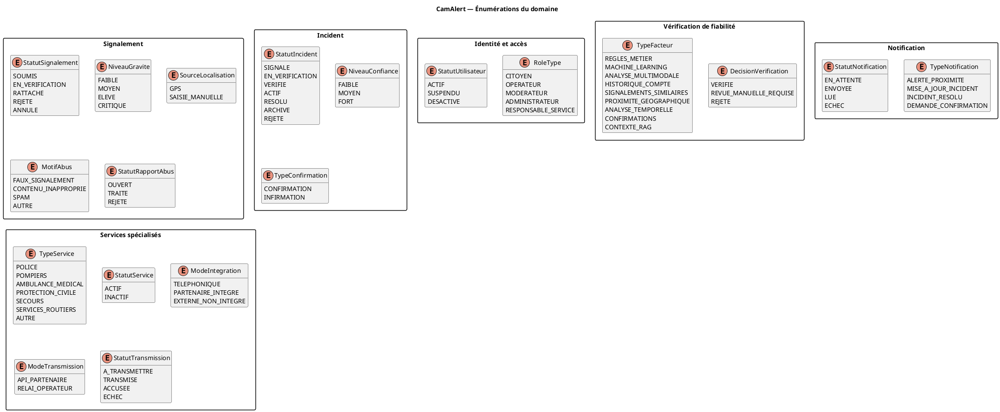
```plantuml
@startuml 01b_enumerations
title CamAlert — Énumérations du domaine
top to bottom direction
skinparam shadowing false
skinparam packageStyle rectangle
hide empty members

package "Identité et accès" {
  enum RoleType {
    CITOYEN
    OPERATEUR
    MODERATEUR
    ADMINISTRATEUR
    RESPONSABLE_SERVICE
  }
  enum StatutUtilisateur {
    ACTIF
    SUSPENDU
    DESACTIVE
  }
}

package "Signalement" {
  enum StatutSignalement {
    SOUMIS
    EN_VERIFICATION
    RATTACHE
    REJETE
    ANNULE
  }
  enum NiveauGravite {
    FAIBLE
    MOYEN
    ELEVE
    CRITIQUE
  }
  enum SourceLocalisation {
    GPS
    SAISIE_MANUELLE
  }
  enum MotifAbus {
    FAUX_SIGNALEMENT
    CONTENU_INAPPROPRIE
    SPAM
    AUTRE
  }
  enum StatutRapportAbus {
    OUVERT
    TRAITE
    REJETE
  }
}

package "Incident" {
  enum StatutIncident {
    SIGNALE
    EN_VERIFICATION
    VERIFIE
    ACTIF
    RESOLU
    ARCHIVE
    REJETE
  }
  enum NiveauConfiance {
    FAIBLE
    MOYEN
    FORT
  }
  enum TypeConfirmation {
    CONFIRMATION
    INFIRMATION
  }
}

package "Vérification de fiabilité" {
  enum DecisionVerification {
    VERIFIE
    REVUE_MANUELLE_REQUISE
    REJETE
  }
  enum TypeFacteur {
    REGLES_METIER
    MACHINE_LEARNING
    ANALYSE_MULTIMODALE
    HISTORIQUE_COMPTE
    SIGNALEMENTS_SIMILAIRES
    PROXIMITE_GEOGRAPHIQUE
    ANALYSE_TEMPORELLE
    CONFIRMATIONS
    CONTEXTE_RAG
  }
}

package "Services spécialisés" {
  enum TypeService {
    POLICE
    POMPIERS
    AMBULANCE_MEDICAL
    PROTECTION_CIVILE
    SECOURS
    SERVICES_ROUTIERS
    AUTRE
  }
  enum StatutService {
    ACTIF
    INACTIF
  }
  enum ModeIntegration {
    TELEPHONIQUE
    PARTENAIRE_INTEGRE
    EXTERNE_NON_INTEGRE
  }
  enum ModeTransmission {
    API_PARTENAIRE
    RELAI_OPERATEUR
  }
  enum StatutTransmission {
    A_TRANSMETTRE
    TRANSMISE
    ACCUSEE
    ECHEC
  }
}

package "Notification" {
  enum TypeNotification {
    ALERTE_PROXIMITE
    MISE_A_JOUR_INCIDENT
    INCIDENT_RESOLU
    DEMANDE_CONFIRMATION
  }
  enum StatutNotification {
    EN_ATTENTE
    ENVOYEE
    LUE
    ECHEC
  }
}

@enduml
```

**Explication.** `TypeIncident` est une classe (et non une énumération) car l'administration peut modifier les catégories. Les valeurs de `NiveauGravite` et de `TypeService` sont des propositions à valider.

### B.3 Cycle de vie d'un incident — `07_etats_incident.puml`

**Objectif.** Formaliser les statuts demandés (SIGNALÉ → EN_VÉRIFICATION → VÉRIFIÉ → ACTIF → RÉSOLU → ARCHIVÉ, et le rejet).

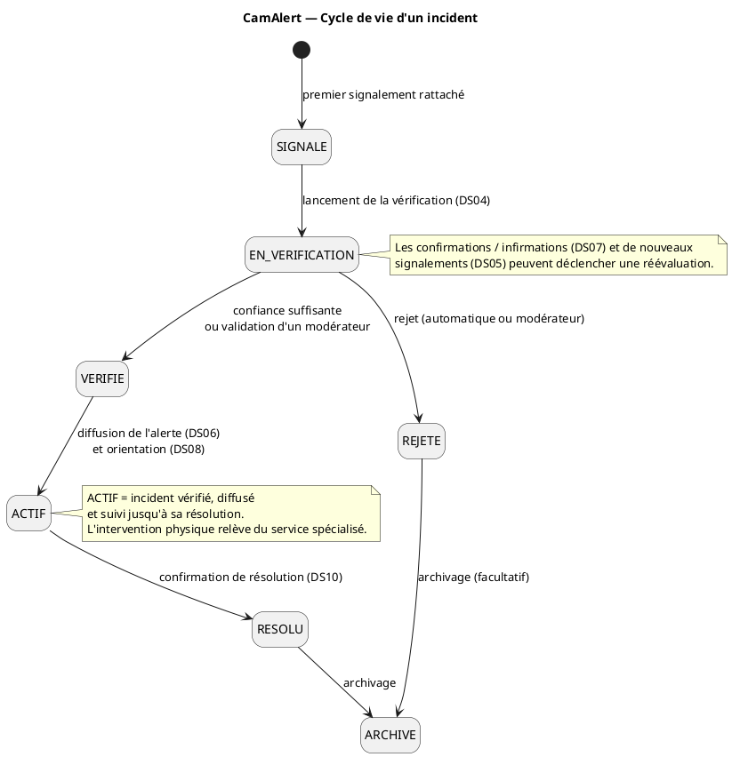
```plantuml
@startuml 07_etats_incident
title CamAlert — Cycle de vie d'un incident

skinparam shadowing false
hide empty description

[*] --> SIGNALE : premier signalement rattaché
SIGNALE --> EN_VERIFICATION : lancement de la vérification (DS04)
EN_VERIFICATION --> VERIFIE : confiance suffisante\nou validation d'un modérateur
EN_VERIFICATION --> REJETE : rejet (automatique ou modérateur)
VERIFIE --> ACTIF : diffusion de l'alerte (DS06)\net orientation (DS08)
ACTIF --> RESOLU : confirmation de résolution (DS10)
RESOLU --> ARCHIVE : archivage
REJETE --> ARCHIVE : archivage (facultatif)

note right of ACTIF
  ACTIF = incident vérifié, diffusé
  et suivi jusqu'à sa résolution.
  L'intervention physique relève du service spécialisé.
end note
note right of EN_VERIFICATION
  Les confirmations / infirmations (DS07) et de nouveaux
  signalements (DS05) peuvent déclencher une réévaluation.
end note
@enduml
```

**Explication.** Chaque transition correspond à une séquence : DS04 (vérification), DS06 et DS08 (diffusion et orientation), DS10 (résolution), DS11 (actions manuelles).

### B.4 Services applicatifs — `02_classes_services.puml`

**Objectif.** Montrer les responsabilités des modules du backend, et les interfaces qui isolent les services IA, le fournisseur de notifications et les modes de transmission.


```plantuml
@startuml 02_classes_services
title CamAlert — Diagramme de classes des services applicatifs (backend)

top to bottom direction
skinparam classAttributeIconSize 0
skinparam shadowing false
skinparam nodesep 35
skinparam ranksep 55
hide empty members

package "Signalements et incidents" as SI {
  class ServiceSignalement {
    +creer(donnees, localisation) : Signalement
    +ajouterPreuve(signalement, fichier) : Preuve
    +modifier(signalement, donnees) : Signalement
    +annuler(signalement) : void
  }
  class ServiceIncident {
    +changerStatut(incident, statut, motif) : void
    +modifierCategorie(incident, type) : void
    +modifierGravite(incident, gravite) : void
    +confirmerResolution(incident) : void
    +archiver(incident) : void
  }
  class MoteurCorrelation {
    +correler(signalement) : Incident
    +rechercherSimilaires(signalement) : List<Signalement>
  }
  class ServiceConfirmation {
    +enregistrer(utilisateur, incident, type) : Confirmation
  }
}

package "Vérification de fiabilité" as VF {
  class MoteurVerification {
    +verifier(signalement) : EvaluationFiabilite
    +reevaluer(incident) : EvaluationFiabilite
  }
  interface AnalyseurFiabilite {
    +analyser(contexte : ContexteVerification) : FacteurFiabilite
  }
  class ContexteVerification {
    +signalement : Signalement
    +preuves : List<Preuve>
    +similaires : List<Signalement>
    +reputation : ReputationUtilisateur
  }
  class AnalyseurReglesMetier
  class AnalyseurHistoriqueCompte
  class AnalyseurSignalementsSimilaires
  class AnalyseurML
  class AnalyseurMultimodal
  class AnalyseurContexteRAG
  class CalculateurScore {
    +agreger(facteurs : List<FacteurFiabilite>) : EvaluationFiabilite
  }
}

package "IA (services distants)" as IA {
  interface ClientML {
    +scorer(caracteristiques) : float
  }
  interface ClientMultimodal {
    +analyser(texte, medias) : float
  }
  interface ClientRAG {
    +recupererContexte(signalement) : List<ExtraitContexte>
  }
  class ExtraitContexte {
    +source : String
    +texte : String
    +pertinence : float
  }
}

package "Notification" as NO {
  class ServiceNotification {
    +diffuser(incident) : void
    +notifierMiseAJour(incident) : void
    +notifierResolution(incident) : void
  }
  class SelecteurDestinataires {
    +selectionner(incident) : List<Utilisateur>
  }
  interface FournisseurNotification {
    +envoyer(appareil, message) : StatutNotification
  }
}

package "Orientation vers les services spécialisés" as SS {
  class ServiceServicesSpecialises {
    +lister(filtres) : List<ServiceSpecialise>
    +configurer(service) : ServiceSpecialise
    +tracerContact(utilisateur, service) : ContactService
  }
  class IdentificateurService {
    +identifier(incident) : List<ServiceSpecialise>
  }
  class ServiceTransmission {
    +transmettre(incident, service) : TransmissionIncident
  }
  interface PasserelleTransmission {
    +envoyer(incident, service) : StatutTransmission
  }
  class PasserelleApiPartenaire
  class PasserelleRelaiOperateur
}

package "Transverse" as TR {
  class ServiceAuthentification {
    +inscrire(donnees) : Utilisateur
    +connecter(identifiant, motDePasse) : Jeton
    +verifierPermission(jeton, permission) : boolean
  }
  class ServiceUtilisateur {
    +lister(filtres) : List<Utilisateur>
    +enregistrer(donnees) : Utilisateur
    +changerStatut(utilisateur, statut) : void
    +affecterRoles(utilisateur, roles) : void
  }
  class ServiceModeration {
    +traiterRapportAbus(rapport, decision) : void
    +suspendreCompte(utilisateur) : void
  }
  class ServiceAudit {
    +tracer(acteur, action, entite) : JournalAudit
  }
  interface StockageMedia {
    +stocker(fichier) : String
    +obtenirUrl(reference) : String
  }
}

' ---------- Héritages / réalisations ----------
AnalyseurFiabilite <|.. AnalyseurReglesMetier
AnalyseurFiabilite <|.. AnalyseurHistoriqueCompte
AnalyseurFiabilite <|.. AnalyseurSignalementsSimilaires
AnalyseurFiabilite <|.. AnalyseurML
AnalyseurFiabilite <|.. AnalyseurMultimodal
AnalyseurFiabilite <|.. AnalyseurContexteRAG
PasserelleTransmission <|.. PasserelleApiPartenaire
PasserelleTransmission <|.. PasserelleRelaiOperateur

' ---------- Dépendances ----------
ServiceSignalement ..> StockageMedia
ServiceSignalement ..> MoteurVerification : déclenche >
MoteurVerification o-- "1..*" AnalyseurFiabilite
MoteurVerification ..> ContexteVerification
MoteurVerification ..> CalculateurScore
AnalyseurML ..> ClientML
AnalyseurMultimodal ..> ClientMultimodal
AnalyseurContexteRAG ..> ClientRAG
ClientRAG ..> ExtraitContexte
MoteurVerification ..> MoteurCorrelation : utilise >
MoteurVerification ..> ServiceIncident : propose une décision >
ServiceConfirmation ..> MoteurVerification : demande une réévaluation >
ServiceIncident ..> ServiceNotification
ServiceIncident ..> ServiceTransmission
ServiceIncident ..> ServiceAudit
ServiceNotification ..> SelecteurDestinataires
ServiceNotification ..> FournisseurNotification
ServiceTransmission ..> IdentificateurService
ServiceTransmission o-- PasserelleTransmission
ServiceModeration ..> ServiceAudit
ServiceModeration ..> ServiceIncident
ServiceModeration ..> ServiceUtilisateur
ServiceUtilisateur ..> ServiceAudit
ServiceUtilisateur ..> ServiceAuthentification

note right of CalculateurScore
  Les pondérations et seuils de décision proviennent
  de ParametrePlateforme (configurables, non figés).
  Le RAG n'est qu'un facteur parmi d'autres :
  il fournit du contexte, il ne décide pas.
end note

note right of PasserelleRelaiOperateur
  Pour un service non intégré, la plateforme crée
  une transmission A_TRANSMETTRE et un opérateur
  relaie l'information par téléphone (hypothèse à valider).
end note

@enduml
```

**Explication.**
- `MoteurVerification` orchestre plusieurs `AnalyseurFiabilite` (règles, historique, similarité, ML, multimodal, RAG) puis `CalculateurScore`. Le RAG n'est qu'un analyseur parmi d'autres.
- `MoteurCorrelation` recherche les signalements similaires et rattache à un incident.
- `PasserelleTransmission` a deux réalisations : `PasserelleApiPartenaire` et `PasserelleRelaiOperateur`, ce qui évite de supposer que tous les services sont connectés.

## C. Diagrammes de séquence

Quinze scénarios : les onze demandés (DS01 à DS11) et quatre compléments (DS12 à DS15) justifiés par des classes et des packages du modèle (abus, gestion des utilisateurs, gestion des services, statistiques/audit/paramètres). Les participants portent les mêmes noms que les packages du backend.

### DS01 — Inscription — `DS01_inscription.puml`

**Objectif.** Décrire la création d'un compte citoyen.

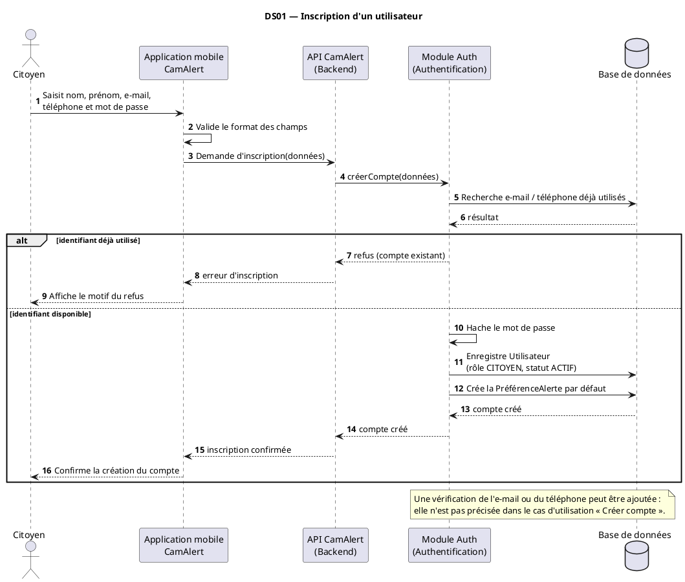
```plantuml
@startuml DS01_inscription
title DS01 — Inscription d'un utilisateur
autonumber
skinparam shadowing false
skinparam sequenceMessageAlign left

actor "Citoyen" as U
participant "Application mobile\nCamAlert" as M
participant "API CamAlert\n(Backend)" as API
participant "Module Auth\n(Authentification)" as AUTH
database "Base de données" as DB

U -> M : Saisit nom, prénom, e-mail,\ntéléphone et mot de passe
M -> M : Valide le format des champs
M -> API : Demande d'inscription(données)
API -> AUTH : créerCompte(données)
AUTH -> DB : Recherche e-mail / téléphone déjà utilisés
DB --> AUTH : résultat

alt identifiant déjà utilisé
  AUTH --> API : refus (compte existant)
  API --> M : erreur d'inscription
  M --> U : Affiche le motif du refus
else identifiant disponible
  AUTH -> AUTH : Hache le mot de passe
  AUTH -> DB : Enregistre Utilisateur\n(rôle CITOYEN, statut ACTIF)
  AUTH -> DB : Crée la PréférenceAlerte par défaut
  DB --> AUTH : compte créé
  AUTH --> API : compte créé
  API --> M : inscription confirmée
  M --> U : Confirme la création du compte
end

note over AUTH, DB
  Une vérification de l'e-mail ou du téléphone peut être ajoutée :
  elle n'est pas précisée dans le cas d'utilisation « Créer compte ».
end note
@enduml
```

**Explication.** Le mot de passe est haché avant enregistrement ; un doublon d'e-mail ou de téléphone est refusé. Une `PreferenceAlerte` par défaut est créée.

### DS02 — Connexion — `DS02_connexion.puml`

**Objectif.** Décrire l'authentification et l'enregistrement de l'appareil.

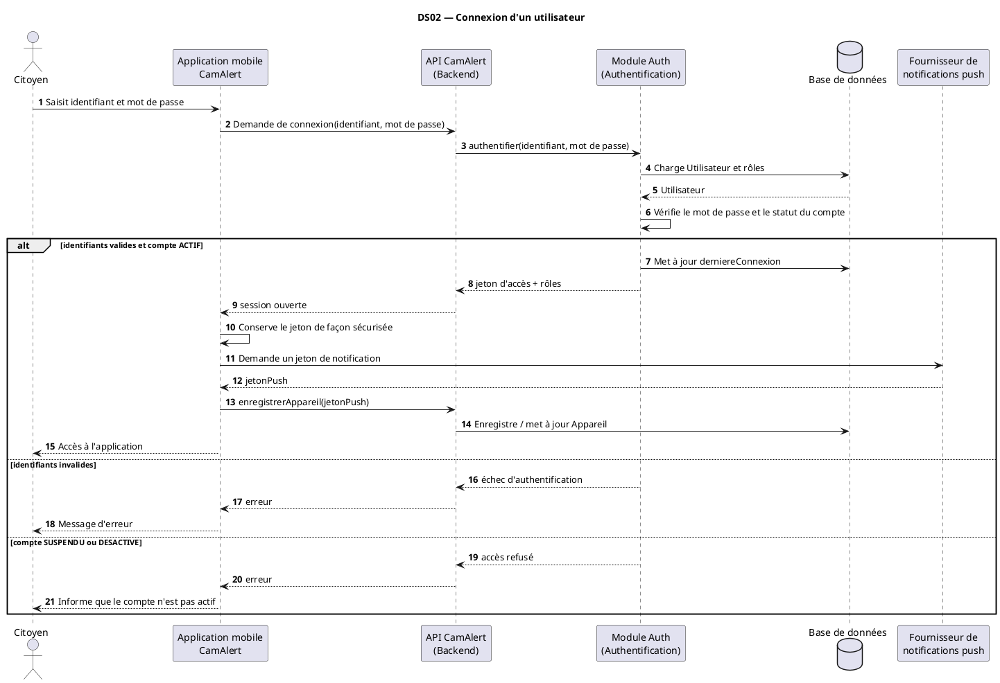
```plantuml
@startuml DS02_connexion
title DS02 — Connexion d'un utilisateur
autonumber
skinparam shadowing false
skinparam sequenceMessageAlign left

actor "Citoyen" as U
participant "Application mobile\nCamAlert" as M
participant "API CamAlert\n(Backend)" as API
participant "Module Auth\n(Authentification)" as AUTH
database "Base de données" as DB
participant "Fournisseur de\nnotifications push" as PUSH

U -> M : Saisit identifiant et mot de passe
M -> API : Demande de connexion(identifiant, mot de passe)
API -> AUTH : authentifier(identifiant, mot de passe)
AUTH -> DB : Charge Utilisateur et rôles
DB --> AUTH : Utilisateur
AUTH -> AUTH : Vérifie le mot de passe et le statut du compte

alt identifiants valides et compte ACTIF
  AUTH -> DB : Met à jour derniereConnexion
  AUTH --> API : jeton d'accès + rôles
  API --> M : session ouverte
  M -> M : Conserve le jeton de façon sécurisée
  M -> PUSH : Demande un jeton de notification
  PUSH --> M : jetonPush
  M -> API : enregistrerAppareil(jetonPush)
  API -> DB : Enregistre / met à jour Appareil
  M --> U : Accès à l'application
else identifiants invalides
  AUTH --> API : échec d'authentification
  API --> M : erreur
  M --> U : Message d'erreur
else compte SUSPENDU ou DESACTIVE
  AUTH --> API : accès refusé
  API --> M : erreur
  M --> U : Informe que le compte n'est pas actif
end
@enduml
```

**Explication.** Le jeton de notification est obtenu auprès du fournisseur push puis enregistré (`Appareil`), ce qui rend DS06 possible.

### DS03 — Création d'un signalement — `DS03_creation_signalement.puml`

**Objectif.** Décrire la saisie, la localisation GPS, l'envoi des preuves et le déclenchement de la vérification.

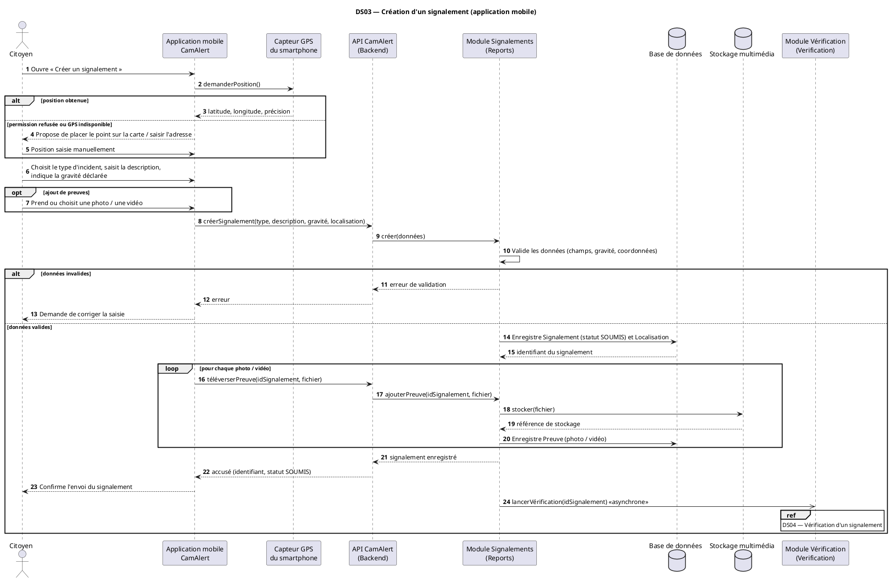
```plantuml
@startuml DS03_creation_signalement
title DS03 — Création d'un signalement (application mobile)
autonumber
skinparam shadowing false
skinparam sequenceMessageAlign left

actor "Citoyen" as U
participant "Application mobile\nCamAlert" as M
participant "Capteur GPS\ndu smartphone" as GPS
participant "API CamAlert\n(Backend)" as API
participant "Module Signalements\n(Reports)" as SIG
database "Base de données" as DB
database "Stockage multimédia" as STO
participant "Module Vérification\n(Verification)" as VER

U -> M : Ouvre « Créer un signalement »
M -> GPS : demanderPosition()
alt position obtenue
  GPS --> M : latitude, longitude, précision
else permission refusée ou GPS indisponible
  M --> U : Propose de placer le point sur la carte / saisir l'adresse
  U -> M : Position saisie manuellement
end
U -> M : Choisit le type d'incident, saisit la description,\nindique la gravité déclarée
opt ajout de preuves
  U -> M : Prend ou choisit une photo / une vidéo
end

M -> API : créerSignalement(type, description, gravité, localisation)
API -> SIG : créer(données)
SIG -> SIG : Valide les données (champs, gravité, coordonnées)
alt données invalides
  SIG --> API : erreur de validation
  API --> M : erreur
  M --> U : Demande de corriger la saisie
else données valides
  SIG -> DB : Enregistre Signalement (statut SOUMIS) et Localisation
  DB --> SIG : identifiant du signalement
  loop pour chaque photo / vidéo
    M -> API : téléverserPreuve(idSignalement, fichier)
    API -> SIG : ajouterPreuve(idSignalement, fichier)
    SIG -> STO : stocker(fichier)
    STO --> SIG : référence de stockage
    SIG -> DB : Enregistre Preuve (photo / vidéo)
  end
  SIG --> API : signalement enregistré
  API --> M : accusé (identifiant, statut SOUMIS)
  M --> U : Confirme l'envoi du signalement
  SIG ->> VER : lancerVérification(idSignalement) <<asynchrone>>
  ref over VER : DS04 — Vérification d'un signalement
end
@enduml
```

**Explication.** Repli sur une position saisie manuellement si le GPS est indisponible. Les médias sont stockés à part, la base ne conserve que la référence. La vérification est lancée en asynchrone (DS04).

### DS04 — Vérification d'un signalement — `DS04_verification.puml`

**Objectif.** Décrire le calcul du score de fiabilité et la décision.

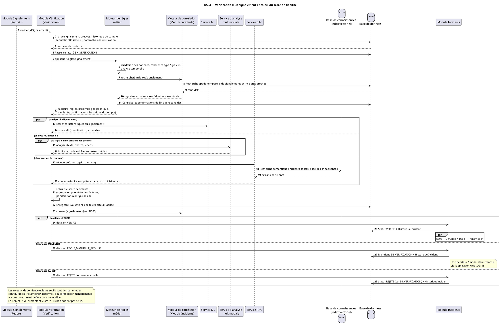
```plantuml
@startuml DS04_verification
title DS04 — Vérification d'un signalement et calcul du score de fiabilité
autonumber
skinparam shadowing false
skinparam sequenceMessageAlign left

participant "Module Signalements\n(Reports)" as SIG
participant "Module Vérification\n(Verification)" as VER
participant "Moteur de règles\nmétier" as REG
participant "Moteur de corrélation\n(Module Incidents)" as COR
participant "Service ML" as ML
participant "Service d'analyse\nmultimodale" as MM
participant "Service RAG" as RAG
database "Base de connaissances\n(index vectoriel)" as KB
database "Base de données" as DB
participant "Module Incidents" as INC

SIG ->> VER : vérifier(idSignalement)
VER -> DB : Charge signalement, preuves, historique du compte\n(ReputationUtilisateur), paramètres de vérification
DB --> VER : données de contexte
VER -> DB : Passe le statut à EN_VERIFICATION

VER -> REG : appliquerRègles(signalement)
REG -> REG : Validation des données, cohérence type / gravité,\nanalyse temporelle
REG -> COR : rechercherSimilaires(signalement)
COR -> DB : Recherche spatio-temporelle de signalements et incidents proches
DB --> COR : candidats
COR --> REG : signalements similaires / doublons éventuels
REG -> DB : Consulte les confirmations de l'incident candidat
REG --> VER : facteurs (règles, proximité géographique,\nsimilarité, confirmations, historique du compte)

par analyses indépendantes
  VER -> ML : scorer(caractéristiques du signalement)
  ML --> VER : score ML (classification, anomalie)
else analyse multimodale
  opt le signalement contient des preuves
    VER -> MM : analyser(texte, photos, vidéos)
    MM --> VER : indicateurs de cohérence texte / médias
  end
else récupération de contexte
  VER -> RAG : récupérerContexte(signalement)
  RAG -> KB : Recherche sémantique (incidents passés, base de connaissances)
  KB --> RAG : extraits pertinents
  RAG --> VER : contexte (indice complémentaire, non décisionnel)
end

VER -> VER : Calcule le score de fiabilité\n(agrégation pondérée des facteurs,\npondérations configurables)
VER -> DB : Enregistre EvaluationFiabilite et FacteurFiabilite
VER -> COR : correler(signalement) (voir DS05)

alt confiance FORTE
  VER -> INC : décision VERIFIE
  INC -> DB : Statut VERIFIE + HistoriqueIncident
  ref over INC : DS06 — Diffusion  /  DS08 — Transmission
else confiance MOYENNE
  VER -> INC : décision REVUE_MANUELLE_REQUISE
  INC -> DB : Maintient EN_VERIFICATION + HistoriqueIncident
  note right of INC : Un opérateur / modérateur tranche\nvia l'application web (DS11)
else confiance FAIBLE
  VER -> INC : décision REJETE ou revue manuelle
  INC -> DB : Statut REJETE (ou EN_VERIFICATION) + HistoriqueIncident
end

note over VER
  Les niveaux de confiance et leurs seuils sont des paramètres
  configurables (ParametrePlateforme), à calibrer expérimentalement :
  aucune valeur n'est définie dans ce modèle.
  Le RAG et le ML alimentent le score ; ils ne décident pas seuls.
end note
@enduml
```

**Explication.** Les analyses ML, multimodale et RAG s'exécutent en parallèle. Le RAG apporte du contexte, il ne décide pas. Les seuils sont des paramètres non chiffrés. Trois issues : vérifié, revue manuelle, rejet.

### DS05 — Agrégation de signalements — `DS05_agregation.puml`

**Objectif.** Montrer comment A, B et C deviennent un incident unique.

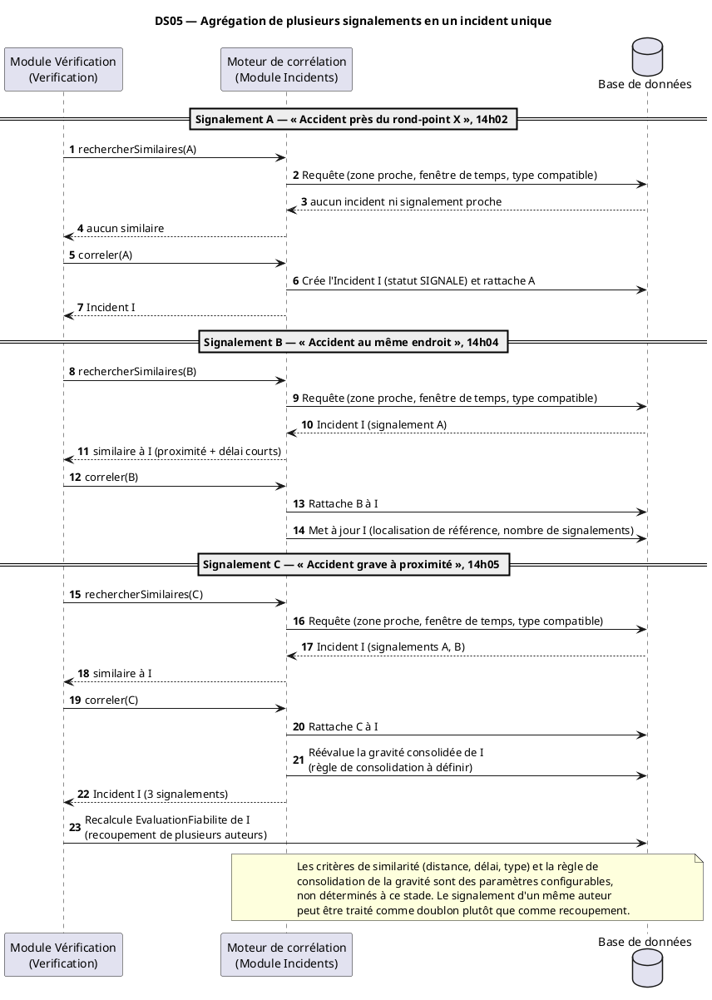
```plantuml
@startuml DS05_agregation
title DS05 — Agrégation de plusieurs signalements en un incident unique
autonumber
skinparam shadowing false
skinparam sequenceMessageAlign left

participant "Module Vérification\n(Verification)" as VER
participant "Moteur de corrélation\n(Module Incidents)" as COR
database "Base de données" as DB

== Signalement A — « Accident près du rond-point X », 14h02 ==
VER -> COR : rechercherSimilaires(A)
COR -> DB : Requête (zone proche, fenêtre de temps, type compatible)
DB --> COR : aucun incident ni signalement proche
COR --> VER : aucun similaire
VER -> COR : correler(A)
COR -> DB : Crée l'Incident I (statut SIGNALE) et rattache A
COR --> VER : Incident I

== Signalement B — « Accident au même endroit », 14h04 ==
VER -> COR : rechercherSimilaires(B)
COR -> DB : Requête (zone proche, fenêtre de temps, type compatible)
DB --> COR : Incident I (signalement A)
COR --> VER : similaire à I (proximité + délai courts)
VER -> COR : correler(B)
COR -> DB : Rattache B à I
COR -> DB : Met à jour I (localisation de référence, nombre de signalements)

== Signalement C — « Accident grave à proximité », 14h05 ==
VER -> COR : rechercherSimilaires(C)
COR -> DB : Requête (zone proche, fenêtre de temps, type compatible)
DB --> COR : Incident I (signalements A, B)
COR --> VER : similaire à I
VER -> COR : correler(C)
COR -> DB : Rattache C à I
COR -> DB : Réévalue la gravité consolidée de I\n(règle de consolidation à définir)
COR --> VER : Incident I (3 signalements)

VER -> DB : Recalcule EvaluationFiabilite de I\n(recoupement de plusieurs auteurs)

note over COR, DB
  Les critères de similarité (distance, délai, type) et la règle de
  consolidation de la gravité sont des paramètres configurables,
  non déterminés à ce stade. Le signalement d'un même auteur
  peut être traité comme doublon plutôt que comme recoupement.
end note
@enduml
```

**Explication.** Le moteur de corrélation crée l'incident pour A puis rattache B et C selon des critères de proximité, de délai et de type (paramétrables). La fiabilité est ensuite recalculée.

### DS06 — Diffusion d'une alerte — `DS06_diffusion_alerte.puml`

**Objectif.** Décrire la sélection des destinataires et l'envoi des notifications.

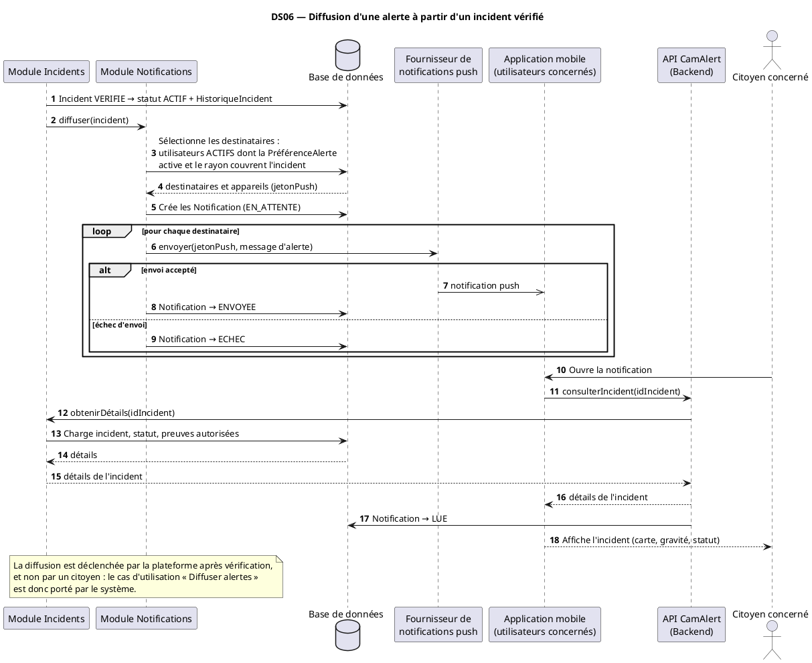
```plantuml
@startuml DS06_diffusion_alerte
title DS06 — Diffusion d'une alerte à partir d'un incident vérifié
autonumber
skinparam shadowing false
skinparam sequenceMessageAlign left

participant "Module Incidents" as INC
participant "Module Notifications" as NOT
database "Base de données" as DB
participant "Fournisseur de\nnotifications push" as PUSH
participant "Application mobile\n(utilisateurs concernés)" as M
participant "API CamAlert\n(Backend)" as API
actor "Citoyen concerné" as U2

INC -> DB : Incident VERIFIE → statut ACTIF + HistoriqueIncident
INC -> NOT : diffuser(incident)
NOT -> DB : Sélectionne les destinataires :\nutilisateurs ACTIFS dont la PréférenceAlerte\nactive et le rayon couvrent l'incident
DB --> NOT : destinataires et appareils (jetonPush)
NOT -> DB : Crée les Notification (EN_ATTENTE)

loop pour chaque destinataire
  NOT -> PUSH : envoyer(jetonPush, message d'alerte)
  alt envoi accepté
    PUSH ->> M : notification push
    NOT -> DB : Notification → ENVOYEE
  else échec d'envoi
    NOT -> DB : Notification → ECHEC
  end
end

U2 -> M : Ouvre la notification
M -> API : consulterIncident(idIncident)
API -> INC : obtenirDétails(idIncident)
INC -> DB : Charge incident, statut, preuves autorisées
DB --> INC : détails
INC --> API : détails de l'incident
API --> M : détails de l'incident
API -> DB : Notification → LUE
M --> U2 : Affiche l'incident (carte, gravité, statut)

note over NOT
  La diffusion est déclenchée par la plateforme après vérification,
  et non par un citoyen : le cas d'utilisation « Diffuser alertes »
  est donc porté par le système.
end note
@enduml
```

**Explication.** La diffusion est portée par la plateforme après vérification. Chaque notification suit ses statuts (EN_ATTENTE, ENVOYEE, ECHEC, LUE).

### DS07 — Confirmation communautaire — `DS07_confirmation_communautaire.puml`

**Objectif.** Décrire la confirmation ou l'infirmation d'un incident et le recalcul de fiabilité.

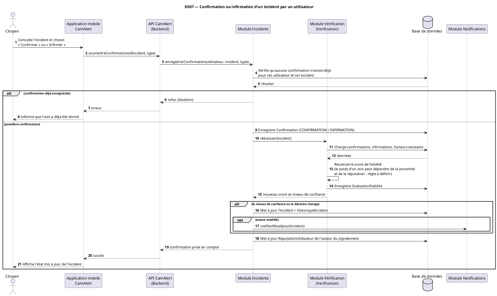
```plantuml
@startuml DS07_confirmation_communautaire
title DS07 — Confirmation ou infirmation d'un incident par un utilisateur
autonumber
skinparam shadowing false
skinparam sequenceMessageAlign left

actor "Citoyen" as U
participant "Application mobile\nCamAlert" as M
participant "API CamAlert\n(Backend)" as API
participant "Module Incidents" as INC
participant "Module Vérification\n(Verification)" as VER
database "Base de données" as DB
participant "Module Notifications" as NOT

U -> M : Consulte l'incident et choisit\n« Confirmer » ou « Infirmer »
M -> API : soumettreConfirmation(idIncident, type)
API -> INC : enregistrerConfirmation(utilisateur, incident, type)
INC -> DB : Vérifie qu'aucune confirmation n'existe déjà\npour cet utilisateur et cet incident
DB --> INC : résultat

alt confirmation déjà enregistrée
  INC --> API : refus (doublon)
  API --> M : erreur
  M --> U : Informe que l'avis a déjà été donné
else première confirmation
  INC -> DB : Enregistre Confirmation (CONFIRMATION / INFIRMATION)
  INC -> VER : réévaluer(incident)
  VER -> DB : Charge confirmations, infirmations, facteurs existants
  DB --> VER : données
  VER -> VER : Recalcule le score de fiabilité\n(le poids d'un avis peut dépendre de la proximité\net de la réputation : règle à définir)
  VER -> DB : Enregistre EvaluationFiabilite
  VER --> INC : nouveau score et niveau de confiance
  alt le niveau de confiance ou la décision change
    INC -> DB : Met à jour l'incident + HistoriqueIncident
    opt statut modifié
      INC -> NOT : notifierMiseAJour(incident)
    end
  end
  INC -> DB : Met à jour ReputationUtilisateur de l'auteur du signalement
  INC --> API : confirmation prise en compte
  API --> M : succès
  M --> U : Affiche l'état mis à jour de l'incident
end
@enduml
```

**Explication.** Une seule confirmation par utilisateur et par incident. Le recalcul peut modifier le statut et déclencher une notification.

### DS08 — Transmission à un service spécialisé — `DS08_transmission_service.puml`

**Objectif.** Décrire l'orientation vers le ou les services concernés.

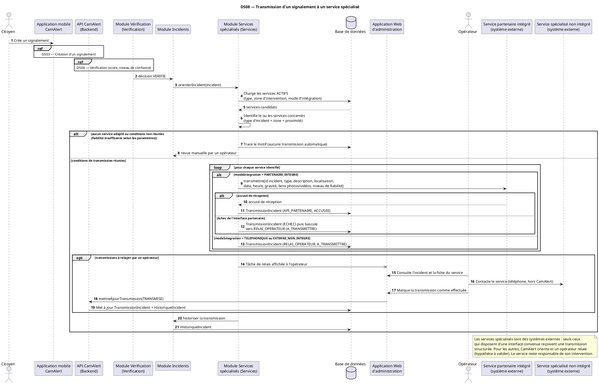
```plantuml
@startuml DS08_transmission_service
title DS08 — Transmission d'un signalement à un service spécialisé
autonumber
skinparam shadowing false
skinparam sequenceMessageAlign left

actor "Citoyen" as U
participant "Application mobile\nCamAlert" as M
participant "API CamAlert\n(Backend)" as API
participant "Module Vérification\n(Verification)" as VER
participant "Module Incidents" as INC
participant "Module Services\nspécialisés (Services)" as SRV
database "Base de données" as DB
participant "Application Web\nd'administration" as W
actor "Opérateur" as OP
participant "Service partenaire intégré\n(système externe)" as PART
participant "Service spécialisé non intégré\n(système externe)" as EXT

U -> M : Crée un signalement
ref over M, API : DS03 — Création d'un signalement
ref over API, VER : DS04 — Vérification (score, niveau de confiance)
VER -> INC : décision VERIFIE
INC -> SRV : orienterIncident(incident)
SRV -> DB : Charge les services ACTIFS\n(type, zone d'intervention, mode d'intégration)
DB --> SRV : services candidats
SRV -> SRV : Identifie le ou les services concernés\n(type d'incident + zone + proximité)

alt aucun service adapté ou conditions non réunies\n(fiabilité insuffisante selon les paramètres)
  SRV -> DB : Trace le motif (aucune transmission automatique)
  SRV --> INC : revue manuelle par un opérateur
else conditions de transmission réunies
  loop pour chaque service identifié
    alt modeIntegration = PARTENAIRE_INTEGRE
      SRV -> PART : transmettre(id incident, type, description, localisation,\ndate, heure, gravité, liens photos/vidéos, niveau de fiabilité)
      alt accusé de réception
        PART --> SRV : accusé de réception
        SRV -> DB : TransmissionIncident (API_PARTENAIRE, ACCUSEE)
      else échec de l'interface partenaire
        SRV -> DB : TransmissionIncident (ECHEC) puis bascule\nvers RELAI_OPERATEUR (A_TRANSMETTRE)
      end
    else modeIntegration = TELEPHONIQUE ou EXTERNE_NON_INTEGRE
      SRV -> DB : TransmissionIncident (RELAI_OPERATEUR, A_TRANSMETTRE)
    end
  end
  opt transmissions à relayer par un opérateur
    SRV ->> W : Tâche de relais affichée à l'opérateur
    OP -> W : Consulte l'incident et la fiche du service
    OP -> EXT : Contacte le service (téléphone, hors CamAlert)
    OP -> W : Marque la transmission comme effectuée
    W -> API : mettreÀJourTransmission(TRANSMISE)
    API -> DB : Met à jour TransmissionIncident + HistoriqueIncident
  end
  SRV -> INC : historiser la transmission
  INC -> DB : HistoriqueIncident
end

note over PART, EXT
  Les services spécialisés sont des systèmes externes : seuls ceux
  qui disposent d'une interface convenue reçoivent une transmission
  structurée. Pour les autres, CamAlert oriente et un opérateur relaie
  (hypothèse à valider). Le service reste responsable de son intervention.
end note
@enduml
```

**Explication.** Trois cas : service partenaire intégré (transmission structurée), échec avec bascule vers un relais, service non intégré (relais par un opérateur, hors CamAlert). Le service reste responsable de son intervention.

### DS09 — Appeler un service — `DS09_appeler_service.puml`

**Objectif.** Décrire l'appel direct depuis le smartphone.

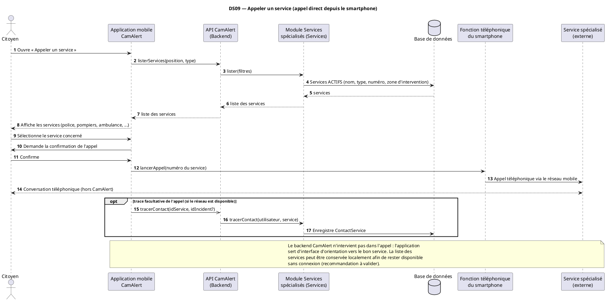
```plantuml
@startuml DS09_appeler_service
title DS09 — Appeler un service (appel direct depuis le smartphone)
autonumber
skinparam shadowing false
skinparam sequenceMessageAlign left

actor "Citoyen" as U
participant "Application mobile\nCamAlert" as M
participant "API CamAlert\n(Backend)" as API
participant "Module Services\nspécialisés (Services)" as SRV
database "Base de données" as DB
participant "Fonction téléphonique\ndu smartphone" as TEL
participant "Service spécialisé\n(externe)" as SVC

U -> M : Ouvre « Appeler un service »
M -> API : listerServices(position, type)
API -> SRV : lister(filtres)
SRV -> DB : Services ACTIFS (nom, type, numéro, zone d'intervention)
DB --> SRV : services
SRV --> API : liste des services
API --> M : liste des services
M --> U : Affiche les services (police, pompiers, ambulance, ...)

U -> M : Sélectionne le service concerné
M -> U : Demande la confirmation de l'appel
U -> M : Confirme
M -> TEL : lancerAppel(numéro du service)
TEL -> SVC : Appel téléphonique via le réseau mobile
SVC <--> U : Conversation téléphonique (hors CamAlert)

opt trace facultative de l'appel (si le réseau est disponible)
  M ->> API : tracerContact(idService, idIncident?)
  API -> SRV : tracerContact(utilisateur, service)
  SRV -> DB : Enregistre ContactService
end

note over M, SVC
  Le backend CamAlert n'intervient pas dans l'appel : l'application
  sert d'interface d'orientation vers le bon service. La liste des
  services peut être conservée localement afin de rester disponible
  sans connexion (recommandation à valider).
end note
@enduml
```

**Explication.** L'appel passe par la fonction téléphonique du téléphone. Le backend ne sert qu'à fournir la liste des services (numéro configurable) et à tracer facultativement le contact.

### DS10 — Résolution d'un incident — `DS10_resolution_incident.puml`

**Objectif.** Décrire la confirmation de résolution et l'information des utilisateurs.

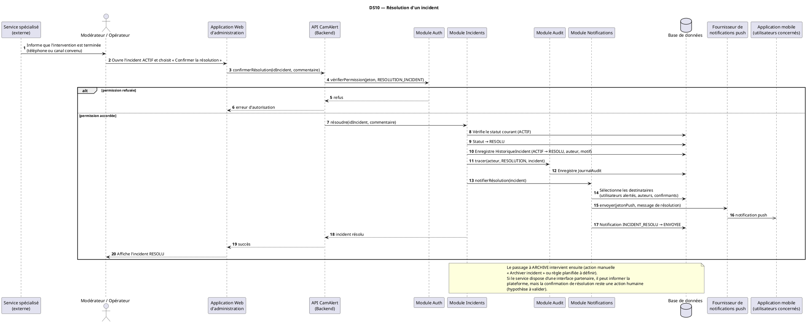
```plantuml
@startuml DS10_resolution_incident
title DS10 — Résolution d'un incident
autonumber
skinparam shadowing false
skinparam sequenceMessageAlign left

participant "Service spécialisé\n(externe)" as SVC
actor "Modérateur / Opérateur" as MODO
participant "Application Web\nd'administration" as W
participant "API CamAlert\n(Backend)" as API
participant "Module Auth" as AUTH
participant "Module Incidents" as INC
participant "Module Audit" as AUD
participant "Module Notifications" as NOT
database "Base de données" as DB
participant "Fournisseur de\nnotifications push" as PUSH
participant "Application mobile\n(utilisateurs concernés)" as M

SVC -> MODO : Informe que l'intervention est terminée\n(téléphone ou canal convenu)
MODO -> W : Ouvre l'incident ACTIF et choisit « Confirmer la résolution »
W -> API : confirmerRésolution(idIncident, commentaire)
API -> AUTH : vérifierPermission(jeton, RESOLUTION_INCIDENT)
alt permission refusée
  AUTH --> API : refus
  API --> W : erreur d'autorisation
else permission accordée
  API -> INC : résoudre(idIncident, commentaire)
  INC -> DB : Vérifie le statut courant (ACTIF)
  INC -> DB : Statut → RESOLU
  INC -> DB : Enregistre HistoriqueIncident (ACTIF → RESOLU, auteur, motif)
  INC -> AUD : tracer(acteur, RESOLUTION, incident)
  AUD -> DB : Enregistre JournalAudit
  INC -> NOT : notifierRésolution(incident)
  NOT -> DB : Sélectionne les destinataires\n(utilisateurs alertés, auteurs, confirmants)
  NOT -> PUSH : envoyer(jetonPush, message de résolution)
  PUSH ->> M : notification push
  NOT -> DB : Notification INCIDENT_RESOLU → ENVOYEE
  INC --> API : incident résolu
  API --> W : succès
  W --> MODO : Affiche l'incident RESOLU
end

note over INC, DB
  Le passage à ARCHIVE intervient ensuite (action manuelle
  « Archiver incident » ou règle planifiée à définir).
  Si le service dispose d'une interface partenaire, il peut informer la
  plateforme, mais la confirmation de résolution reste une action humaine
  (hypothèse à valider).
end note
@enduml
```

**Explication.** Contrôle de permission, changement de statut, historique, audit, puis notification. La confirmation reste une action humaine.

### DS11 — Administration d'un incident — `DS11_administration_incident.puml`

**Objectif.** Décrire la consultation filtrée et les actions du modérateur ou de l'administrateur.

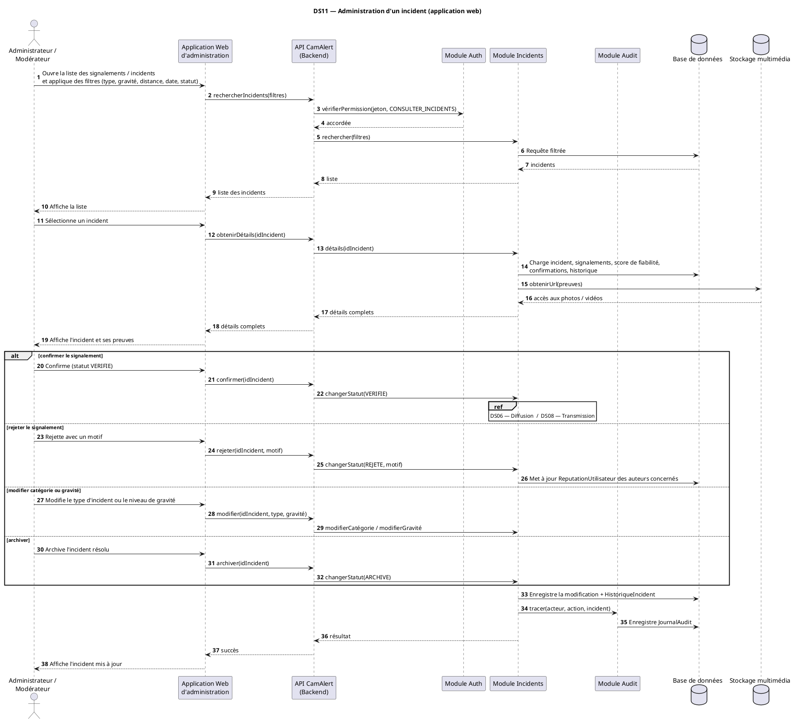
```plantuml
@startuml DS11_administration_incident
title DS11 — Administration d'un incident (application web)
autonumber
skinparam shadowing false
skinparam sequenceMessageAlign left

actor "Administrateur /\nModérateur" as ADM
participant "Application Web\nd'administration" as W
participant "API CamAlert\n(Backend)" as API
participant "Module Auth" as AUTH
participant "Module Incidents" as INC
participant "Module Audit" as AUD
database "Base de données" as DB
database "Stockage multimédia" as STO

ADM -> W : Ouvre la liste des signalements / incidents\net applique des filtres (type, gravité, distance, date, statut)
W -> API : rechercherIncidents(filtres)
API -> AUTH : vérifierPermission(jeton, CONSULTER_INCIDENTS)
AUTH --> API : accordée
API -> INC : rechercher(filtres)
INC -> DB : Requête filtrée
DB --> INC : incidents
INC --> API : liste
API --> W : liste des incidents
W --> ADM : Affiche la liste

ADM -> W : Sélectionne un incident
W -> API : obtenirDétails(idIncident)
API -> INC : détails(idIncident)
INC -> DB : Charge incident, signalements, score de fiabilité,\nconfirmations, historique
INC -> STO : obtenirUrl(preuves)
STO --> INC : accès aux photos / vidéos
INC --> API : détails complets
API --> W : détails complets
W --> ADM : Affiche l'incident et ses preuves

alt confirmer le signalement
  ADM -> W : Confirme (statut VERIFIE)
  W -> API : confirmer(idIncident)
  API -> INC : changerStatut(VERIFIE)
  ref over INC : DS06 — Diffusion  /  DS08 — Transmission
else rejeter le signalement
  ADM -> W : Rejette avec un motif
  W -> API : rejeter(idIncident, motif)
  API -> INC : changerStatut(REJETE, motif)
  INC -> DB : Met à jour ReputationUtilisateur des auteurs concernés
else modifier catégorie ou gravité
  ADM -> W : Modifie le type d'incident ou le niveau de gravité
  W -> API : modifier(idIncident, type, gravité)
  API -> INC : modifierCatégorie / modifierGravité
else archiver
  ADM -> W : Archive l'incident résolu
  W -> API : archiver(idIncident)
  API -> INC : changerStatut(ARCHIVE)
end

INC -> DB : Enregistre la modification + HistoriqueIncident
INC -> AUD : tracer(acteur, action, incident)
AUD -> DB : Enregistre JournalAudit
INC --> API : résultat
API --> W : succès
W --> ADM : Affiche l'incident mis à jour
@enduml
```

**Explication.** Quatre actions : confirmer, rejeter, modifier catégorie/gravité, archiver. Chaque modification est historisée et auditée.

### DS12 — Abus et monitoring — `DS12_abus_monitoring.puml`

**Objectif.** Décrire le signalement d'un abus, la détection automatique de comportements suspects et leur traitement.

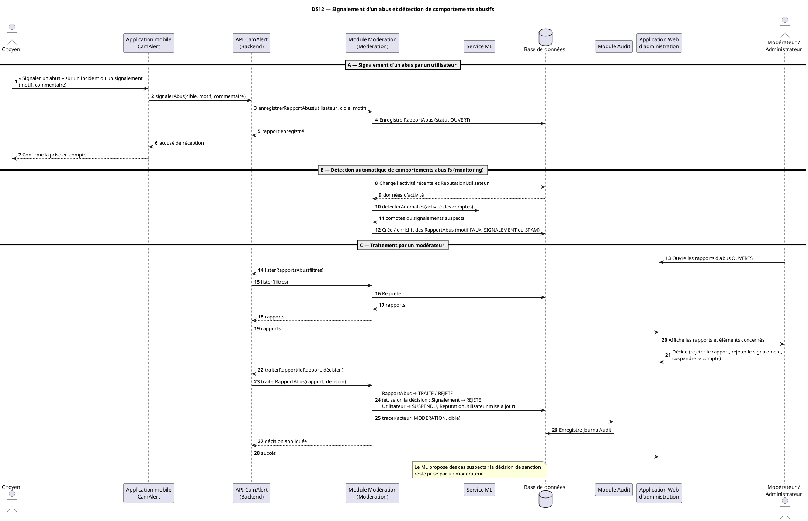
```plantuml
@startuml DS12_abus_monitoring
title DS12 — Signalement d'un abus et détection de comportements abusifs
autonumber
skinparam shadowing false
skinparam sequenceMessageAlign left

actor "Citoyen" as U
participant "Application mobile\nCamAlert" as M
participant "API CamAlert\n(Backend)" as API
participant "Module Modération\n(Moderation)" as MOD
participant "Service ML" as ML
database "Base de données" as DB
participant "Module Audit" as AUD
participant "Application Web\nd'administration" as W
actor "Modérateur /\nAdministrateur" as MODO

== A — Signalement d'un abus par un utilisateur ==
U -> M : « Signaler un abus » sur un incident ou un signalement\n(motif, commentaire)
M -> API : signalerAbus(cible, motif, commentaire)
API -> MOD : enregistrerRapportAbus(utilisateur, cible, motif)
MOD -> DB : Enregistre RapportAbus (statut OUVERT)
MOD --> API : rapport enregistré
API --> M : accusé de réception
M --> U : Confirme la prise en compte

== B — Détection automatique de comportements abusifs (monitoring) ==
MOD -> DB : Charge l'activité récente et ReputationUtilisateur
DB --> MOD : données d'activité
MOD -> ML : détecterAnomalies(activité des comptes)
ML --> MOD : comptes ou signalements suspects
MOD -> DB : Crée / enrichit des RapportAbus (motif FAUX_SIGNALEMENT ou SPAM)

== C — Traitement par un modérateur ==
MODO -> W : Ouvre les rapports d'abus OUVERTS
W -> API : listerRapportsAbus(filtres)
API -> MOD : lister(filtres)
MOD -> DB : Requête
DB --> MOD : rapports
MOD --> API : rapports
API --> W : rapports
W --> MODO : Affiche les rapports et éléments concernés
MODO -> W : Décide (rejeter le rapport, rejeter le signalement,\nsuspendre le compte)
W -> API : traiterRapport(idRapport, décision)
API -> MOD : traiterRapportAbus(rapport, décision)
MOD -> DB : RapportAbus → TRAITE / REJETE\n(et, selon la décision : Signalement → REJETE,\nUtilisateur → SUSPENDU, ReputationUtilisateur mise à jour)
MOD -> AUD : tracer(acteur, MODERATION, cible)
AUD -> DB : Enregistre JournalAudit
MOD --> API : décision appliquée
API --> W : succès

note over ML
  Le ML propose des cas suspects ; la décision de sanction
  reste prise par un modérateur.
end note
@enduml
```

**Explication.** Le ML propose des cas suspects ; la sanction reste décidée par un modérateur.

### DS13 — Utilisateurs et rôles — `DS13_gestion_utilisateurs_roles.puml`

**Objectif.** Décrire la gestion des comptes, statuts et rôles par l'administrateur.

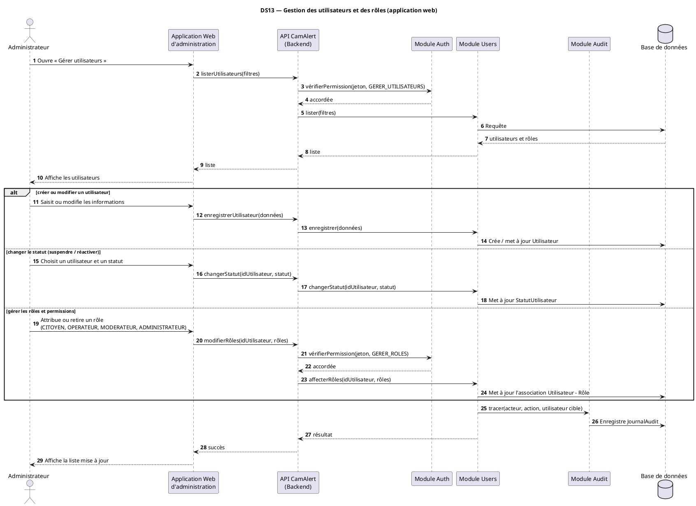
```plantuml
@startuml DS13_gestion_utilisateurs_roles
title DS13 — Gestion des utilisateurs et des rôles (application web)
autonumber
skinparam shadowing false
skinparam sequenceMessageAlign left

actor "Administrateur" as ADM
participant "Application Web\nd'administration" as W
participant "API CamAlert\n(Backend)" as API
participant "Module Auth" as AUTH
participant "Module Users" as USR
participant "Module Audit" as AUD
database "Base de données" as DB

ADM -> W : Ouvre « Gérer utilisateurs »
W -> API : listerUtilisateurs(filtres)
API -> AUTH : vérifierPermission(jeton, GERER_UTILISATEURS)
AUTH --> API : accordée
API -> USR : lister(filtres)
USR -> DB : Requête
DB --> USR : utilisateurs et rôles
USR --> API : liste
API --> W : liste
W --> ADM : Affiche les utilisateurs

alt créer ou modifier un utilisateur
  ADM -> W : Saisit ou modifie les informations
  W -> API : enregistrerUtilisateur(données)
  API -> USR : enregistrer(données)
  USR -> DB : Crée / met à jour Utilisateur
else changer le statut (suspendre / réactiver)
  ADM -> W : Choisit un utilisateur et un statut
  W -> API : changerStatut(idUtilisateur, statut)
  API -> USR : changerStatut(idUtilisateur, statut)
  USR -> DB : Met à jour StatutUtilisateur
else gérer les rôles et permissions
  ADM -> W : Attribue ou retire un rôle\n(CITOYEN, OPERATEUR, MODERATEUR, ADMINISTRATEUR)
  W -> API : modifierRôles(idUtilisateur, rôles)
  API -> AUTH : vérifierPermission(jeton, GERER_ROLES)
  AUTH --> API : accordée
  API -> USR : affecterRôles(idUtilisateur, rôles)
  USR -> DB : Met à jour l'association Utilisateur – Rôle
end

USR -> AUD : tracer(acteur, action, utilisateur cible)
AUD -> DB : Enregistre JournalAudit
USR --> API : résultat
API --> W : succès
W --> ADM : Affiche la liste mise à jour
@enduml
```

**Explication.** Chaque action vérifie une permission et est tracée dans le journal d'audit.

### DS14 — Gestion des services spécialisés — `DS14_gestion_services_specialises.puml`

**Objectif.** Décrire la configuration des numéros, zones et modes d'intégration.

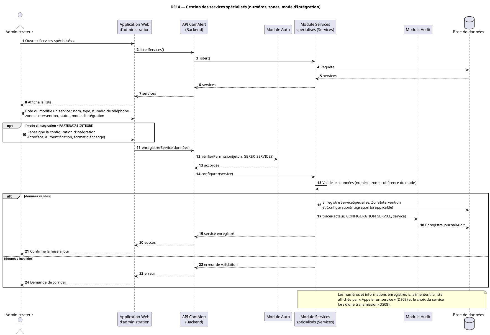
```plantuml
@startuml DS14_gestion_services_specialises
title DS14 — Gestion des services spécialisés (numéros, zones, mode d'intégration)
autonumber
skinparam shadowing false
skinparam sequenceMessageAlign left

actor "Administrateur" as ADM
participant "Application Web\nd'administration" as W
participant "API CamAlert\n(Backend)" as API
participant "Module Auth" as AUTH
participant "Module Services\nspécialisés (Services)" as SRV
participant "Module Audit" as AUD
database "Base de données" as DB

ADM -> W : Ouvre « Services spécialisés »
W -> API : listerServices()
API -> SRV : lister()
SRV -> DB : Requête
DB --> SRV : services
SRV --> API : services
API --> W : services
W --> ADM : Affiche la liste

ADM -> W : Crée ou modifie un service : nom, type, numéro de téléphone,\nzone d'intervention, statut, mode d'intégration
opt mode d'intégration = PARTENAIRE_INTEGRE
  ADM -> W : Renseigne la configuration d'intégration\n(interface, authentification, format d'échange)
end
W -> API : enregistrerService(données)
API -> AUTH : vérifierPermission(jeton, GERER_SERVICES)
AUTH --> API : accordée
API -> SRV : configurer(service)
SRV -> SRV : Valide les données (numéro, zone, cohérence du mode)
alt données valides
  SRV -> DB : Enregistre ServiceSpecialise, ZoneIntervention\net ConfigurationIntegration (si applicable)
  SRV -> AUD : tracer(acteur, CONFIGURATION_SERVICE, service)
  AUD -> DB : Enregistre JournalAudit
  SRV --> API : service enregistré
  API --> W : succès
  W --> ADM : Confirme la mise à jour
else données invalides
  SRV --> API : erreur de validation
  API --> W : erreur
  W --> ADM : Demande de corriger
end

note over SRV, DB
  Les numéros et informations enregistrés ici alimentent la liste
  affichée par « Appeler un service » (DS09) et le choix du service
  lors d'une transmission (DS08).
end note
@enduml
```

**Explication.** Ces données alimentent « Appeler un service » (DS09) et la transmission (DS08).

### DS15 — Statistiques, audit et paramètres — `DS15_statistiques_audit_parametres.puml`

**Objectif.** Décrire la consultation des indicateurs et des journaux, et la modification des paramètres de vérification.

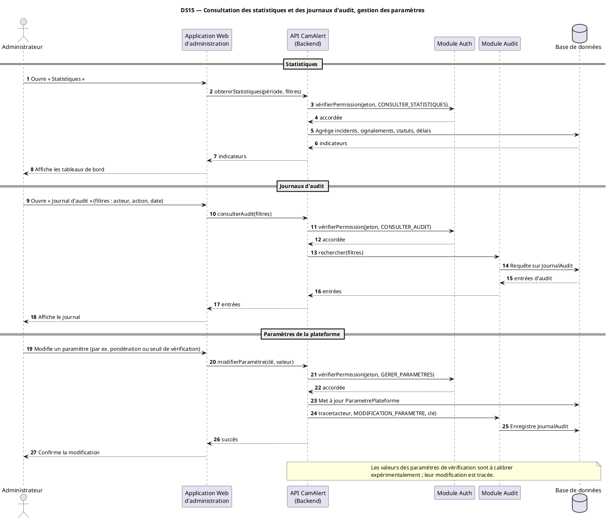
```plantuml
@startuml DS15_statistiques_audit_parametres
title DS15 — Consultation des statistiques et des journaux d'audit, gestion des paramètres
autonumber
skinparam shadowing false
skinparam sequenceMessageAlign left

actor "Administrateur" as ADM
participant "Application Web\nd'administration" as W
participant "API CamAlert\n(Backend)" as API
participant "Module Auth" as AUTH
participant "Module Audit" as AUD
database "Base de données" as DB

== Statistiques ==
ADM -> W : Ouvre « Statistiques »
W -> API : obtenirStatistiques(période, filtres)
API -> AUTH : vérifierPermission(jeton, CONSULTER_STATISTIQUES)
AUTH --> API : accordée
API -> DB : Agrège incidents, signalements, statuts, délais
DB --> API : indicateurs
API --> W : indicateurs
W --> ADM : Affiche les tableaux de bord

== Journaux d'audit ==
ADM -> W : Ouvre « Journal d'audit » (filtres : acteur, action, date)
W -> API : consulterAudit(filtres)
API -> AUTH : vérifierPermission(jeton, CONSULTER_AUDIT)
AUTH --> API : accordée
API -> AUD : rechercher(filtres)
AUD -> DB : Requête sur JournalAudit
DB --> AUD : entrées d'audit
AUD --> API : entrées
API --> W : entrées
W --> ADM : Affiche le journal

== Paramètres de la plateforme ==
ADM -> W : Modifie un paramètre (par ex. pondération ou seuil de vérification)
W -> API : modifierParamètre(clé, valeur)
API -> AUTH : vérifierPermission(jeton, GERER_PARAMETRES)
AUTH --> API : accordée
API -> DB : Met à jour ParametrePlateforme
API -> AUD : tracer(acteur, MODIFICATION_PARAMETRE, clé)
AUD -> DB : Enregistre JournalAudit
API --> W : succès
W --> ADM : Confirme la modification

note over API, DB
  Les valeurs des paramètres de vérification sont à calibrer
  expérimentalement ; leur modification est tracée.
end note
@enduml
```

**Explication.** La modification d'un paramètre est tracée.

## D. Diagramme de packages

### D.1 `04_packages.puml`

**Objectif.** Présenter l'organisation logique : applications clientes, backend, services IA, infrastructure, systèmes externes.

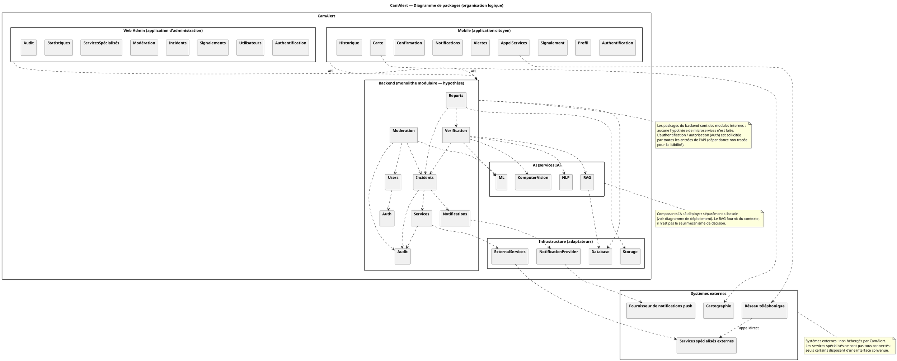
```plantuml
@startuml 04_packages
title CamAlert — Diagramme de packages (organisation logique)

top to bottom direction
skinparam shadowing false
skinparam packageStyle rectangle
skinparam nodesep 30
skinparam ranksep 50

package "CamAlert" as CA {

  package "Mobile (application citoyen)" as MOB {
    package "Authentification" as M_AUTH {
    }
    package "Profil" as M_PROF {
    }
    package "Signalement" as M_SIG {
    }
    package "Carte" as M_CARTE {
    }
    package "Alertes" as M_ALERT {
    }
    package "Notifications" as M_NOTIF {
    }
    package "Confirmation" as M_CONF {
    }
    package "AppelServices" as M_APPEL {
    }
    package "Historique" as M_HIST {
    }
  }

  package "Web Admin (application d'administration)" as WEB {
    package "Authentification" as W_AUTH {
    }
    package "Utilisateurs" as W_USR {
    }
    package "Signalements" as W_SIG {
    }
    package "Incidents" as W_INC {
    }
    package "Modération" as W_MOD {
    }
    package "ServicesSpécialisés" as W_SRV {
    }
    package "Statistiques" as W_STAT {
    }
    package "Audit" as W_AUD {
    }
  }

  package "Backend (monolithe modulaire — hypothèse)" as BACK {
    package "Auth" as B_AUTH {
    }
    package "Users" as B_USR {
    }
    package "Reports" as B_REP {
    }
    package "Incidents" as B_INC {
    }
    package "Verification" as B_VER {
    }
    package "Notifications" as B_NOT {
    }
    package "Services" as B_SRV {
    }
    package "Moderation" as B_MOD {
    }
    package "Audit" as B_AUD {
    }
  }

  package "AI (services IA)" as AI {
    package "ML" as AI_ML {
    }
    package "ComputerVision" as AI_CV {
    }
    package "NLP" as AI_NLP {
    }
    package "RAG" as AI_RAG {
    }
  }

  package "Infrastructure (adaptateurs)" as INFRA {
    package "Database" as I_DB {
    }
    package "Storage" as I_STO {
    }
    package "NotificationProvider" as I_NOTIF {
    }
    package "ExternalServices" as I_EXT {
    }
  }
}

package "Systèmes externes" as EXT {
  package "Cartographie" as X_MAP {
  }
  package "Fournisseur de notifications push" as X_PUSH {
  }
  package "Réseau téléphonique" as X_TEL {
  }
  package "Services spécialisés externes" as X_SVC {
  }
}

' ---------- Clients → backend ----------
MOB ..> BACK : API
WEB ..> BACK : API

' ---------- Dépendances internes du backend ----------
B_REP ..> B_VER
B_REP ..> B_INC
B_VER ..> B_INC
B_INC ..> B_NOT
B_INC ..> B_SRV
B_MOD ..> B_INC
B_MOD ..> B_USR
B_USR ..> B_AUTH
B_INC ..> B_AUD
B_MOD ..> B_AUD
B_SRV ..> B_AUD

' ---------- Backend → IA ----------
B_VER ..> AI_ML
B_VER ..> AI_CV
B_VER ..> AI_NLP
B_VER ..> AI_RAG
B_MOD ..> AI_ML

' ---------- Backend → infrastructure ----------
BACK ..> I_DB
B_REP ..> I_STO
AI_RAG ..> I_DB
B_NOT ..> I_NOTIF
B_SRV ..> I_EXT

' ---------- Infrastructure → externes ----------
I_NOTIF ..> X_PUSH
I_EXT ..> X_SVC

' ---------- Mobile → externes ----------
M_CARTE ..> X_MAP
M_APPEL ..> X_TEL
X_TEL ..> X_SVC : appel direct

note bottom of BACK
  Les packages du backend sont des modules internes :
  aucune hypothèse de microservices n'est faite.
  L'authentification / autorisation (Auth) est sollicitée
  par toutes les entrées de l'API (dépendance non tracée
  pour la lisibilité).
end note

note bottom of AI
  Composants IA : à déployer séparément si besoin
  (voir diagramme de déploiement). Le RAG fournit du contexte,
  il n'est pas le seul mécanisme de décision.
end note

note bottom of EXT
  Systèmes externes : non hébergés par CamAlert.
  Les services spécialisés ne sont pas tous connectés :
  seuls certains disposent d'une interface convenue.
end note
@enduml
```

**Explication.**
- Les packages du backend sont des **modules internes** (monolithe modulaire, hypothèse), et non des microservices.
- Les clients dépendent de l'API du backend. Les dépendances les plus significatives sont tracées : `Reports → Verification → Incidents → Notifications / Services`.
- `Verification` dépend des packages IA ; `Moderation` utilise le ML pour détecter les abus.
- L'infrastructure regroupe des **adaptateurs** vers les systèmes externes, qui restent hors de CamAlert.
- Le package Auth est utilisé par toutes les entrées de l'API : la dépendance n'est pas tracée pour la lisibilité.

## E. Diagramme de déploiement

### E.1 `05_deploiement.puml`

**Objectif.** Montrer où s'exécutent les composants et quels systèmes sont externes.

```plantuml
@startuml 05_deploiement
title CamAlert — Diagramme de déploiement

top to bottom direction
skinparam shadowing false
skinparam nodesep 40
skinparam ranksep 70
skinparam linetype ortho

node "Smartphone utilisateur" as PHONE {
  artifact "Application mobile CamAlert" as APPM
  component "Capteur GPS" as GPS
  component "Fonction téléphonique" as DIAL
}

node "Ordinateur de l'administrateur / modérateur" as PC {
  node "Navigateur web" as BROW {
    artifact "Application Web d'administration" as APPW
  }
}

rectangle "Infrastructure CamAlert" as INFRA {

  node "Serveur d'application" as SRVAPP {
    artifact "Fichiers de l'application Web\n(hébergement à définir)" as WEBFILES
    node "Backend CamAlert\n(monolithe modulaire — hypothèse)" as BACK {
      component "API" as API
      component "Auth" as B_AUTH
      component "Signalements" as B_REP
      component "Incidents\n+ corrélation" as B_INC
      component "Vérification" as B_VER
      component "Notifications" as B_NOT
      component "Services spécialisés" as B_SRV
      component "Modération" as B_MOD
      component "Audit" as B_AUD
    }
  }

  node "Serveur IA" as SRVIA {
    component "Service ML" as ML
    component "Service d'analyse\nmultimodale (texte / images / vidéos)" as MM
    component "Service RAG" as RAG
    component "Modèle de langage (LLM)" as LLM
  }

  node "Serveur de données" as SRVDATA {
    database "Base de données principale" as DB
    database "Index vectoriel /\nbase de connaissances (RAG)" as KB
    storage "Stockage des médias\n(photos, vidéos)" as STO
  }
}

cloud "Services externes" as CLOUD {
  node "Service de cartographie" as MAP
  node "Fournisseur de\nnotifications push" as PUSH
  node "Réseau téléphonique /\nopérateur mobile" as TELNET
}

cloud "Services spécialisés\n(systèmes externes, non hébergés par CamAlert)" as SVCS {
  node "Service partenaire intégré\n(interface convenue)" as PART
  node "Service téléphonique\n(numéro d'appel)" as SVCTEL
  node "Service externe non intégré" as SVCEXT
}

' ---------- Clients ↔ backend ----------
APPM --> API : HTTPS
APPW --> API : HTTPS
APPW ..> WEBFILES : chargement de l'application

' ---------- Backend ↔ IA ----------
B_VER --> ML : évaluation
B_VER --> MM : analyse
B_VER --> RAG : contexte
RAG --> LLM
RAG --> KB
B_MOD --> ML : anomalies

' ---------- Backend ↔ données ----------
BACK --> DB
BACK --> STO

' ---------- Backend ↔ externes ----------
B_NOT --> PUSH : envoi de notifications
PUSH ..> APPM : notification push
APPM --> MAP : affichage cartographique
B_SRV --> PART : transmission structurée\n(API d'intégration)
B_SRV ..> SVCTEL : aucune liaison technique :\nrelais par un opérateur (téléphone)
B_SRV ..> SVCEXT : aucune liaison technique :\nrelais par un opérateur (téléphone)

' ---------- Appel direct ----------
DIAL --> TELNET : appel voix (Cas A)
TELNET --> SVCTEL
TELNET --> SVCEXT
TELNET --> PART
APPM ..> DIAL : « Appeler un service »
APPM ..> GPS : localisation

note bottom of SVCS
  **Cas A — appel direct** : smartphone → réseau téléphonique → service.
  Le backend CamAlert n'intervient pas dans l'appel.
  **Cas B — transmission d'un signalement** : backend → service partenaire
  intégré (API) ; pour les autres services, CamAlert oriente et un opérateur
  relaie l'information (hypothèse à valider).
end note

note right of SRVIA
  Les services IA sont représentés séparément du backend
  (charges de calcul différentes). Leur regroupement sur un
  même serveur est possible selon les ressources disponibles.
end note

note bottom of INFRA
  Aucune technologie de serveur, de base de données ou de
  fournisseur n'est imposée : ces choix restent à définir.
end note
@enduml
```

**Explication.**
- Le **smartphone** porte l'application mobile, le GPS et la fonction téléphonique. Le **poste web** porte l'application d'administration.
- L'infrastructure CamAlert regroupe un serveur d'application (backend), un serveur IA (ML, multimodal, RAG, LLM) et un serveur de données (base principale, index vectoriel, stockage des médias).
- Les **services externes** (cartographie, push, réseau téléphonique) et les **services spécialisés** sont hors infrastructure CamAlert.
- Trois types de services spécialisés : partenaire intégré (API d'intégration), service téléphonique et service non intégré. Ces deux derniers n'ont **aucune liaison technique** avec le backend : relais par un opérateur.
- L'appel direct passe par le réseau téléphonique, sans le backend.

### E.2 Vue de contexte des deux types de contact — `06_contexte_contact_services.puml`

**Objectif.** Représenter la différence entre l'appel direct (cas A) et la transmission d'un signalement (cas B).

```plantuml
@startuml 06_contexte_contact_services
title CamAlert — Vue de contexte : appel direct (Cas A) et transmission d'un signalement (Cas B)

left to right direction
skinparam shadowing false

actor "Citoyen" as C

rectangle "CamAlert (plateforme intermédiaire)" as CA {
  rectangle "Application mobile" as MOB
  rectangle "Backend :\nvérification, qualification,\nidentification du service" as BACK
  rectangle "Application Web\nd'administration" as WEB
}

rectangle "Réseau téléphonique" as TEL

rectangle "Service spécialisé externe\n(Police, Pompiers, Ambulance,\nProtection civile, Secours...)" as SVC {
  rectangle "Service téléphonique" as S1
  rectangle "Service partenaire intégré" as S2
  rectangle "Service externe non intégré" as S3
}

' Cas A
C --> MOB : (A1) « Appeler un service »
MOB --> TEL : (A2) lancement de l'appel
TEL --> SVC : (A3) appel téléphonique

' Cas B
C --> MOB : (B1) crée un signalement
MOB --> BACK : (B2) signalement + localisation
BACK --> BACK : (B3) analyse, fiabilité,\nidentification du service
BACK --> S2 : (B4a) transmission structurée (API)
BACK ..> WEB : (B4b) tâche de relais\npour un opérateur
WEB ..> S1 : (B5) contact téléphonique\npar un opérateur
WEB ..> S3 : (B5) contact téléphonique\npar un opérateur
SVC ..> BACK : (B6) statut d'intervention\n(saisi par un opérateur)
BACK ..> MOB : (B7) notification des\nutilisateurs concernés

note bottom of SVC
  CamAlert n'est pas responsable de l'intervention :
  le service reste maître de ses procédures.
end note
@enduml
```

**Explication.** Le cas A ne fait intervenir que l'application mobile, le réseau téléphonique et le service. Le cas B passe par le backend, qui transmet en structuré à un partenaire intégré, ou crée une tâche de relais pour un opérateur. Le statut d'intervention est remonté par l'opérateur, puis les utilisateurs sont notifiés.

### Cas d'utilisation consolidé (complément) — `00_usecase_consolide.puml`

**Objectif.** Proposer un diagramme de cas d'utilisation corrigé, qui sert de référence aux diagrammes ci-dessus (jaune = cas ajoutés).

```plantuml
@startuml 00_usecase_consolide
title CamAlert — Cas d'utilisation consolidé (proposition)

left to right direction
skinparam shadowing false
skinparam usecase {
  BackgroundColor White
}

actor "Citoyen" as CIT
actor "Modérateur /\nOpérateur" as MODO
actor "Administrateur" as ADM
actor "Service spécialisé\n(externe)" as SVC
actor "Fournisseur de\nnotifications push" as PUSH

rectangle "CamAlert" {

  package "Application mobile" {
    usecase "Créer un compte" as UC1
    usecase "S'authentifier" as UC2
    usecase "Gérer son profil" as UC3 #LightYellow
    usecase "Gérer un signalement" as UC4
    usecase "Créer un signalement" as UC4a
    usecase "Modifier un signalement" as UC4b
    usecase "Annuler un signalement" as UC4c
    usecase "Partager les coordonnées GPS" as UC5
    usecase "Ajouter photo / vidéo" as UC6 #LightYellow
    usecase "Consulter la carte et les\nincidents à proximité" as UC7 #LightYellow
    usecase "Filtrer les alertes\n(type, gravité, distance, date, statut)" as UC8
    usecase "Consulter les détails et\nsuivre l'évolution d'un incident" as UC9 #LightYellow
    usecase "Confirmer / infirmer un incident" as UC10 #LightYellow
    usecase "Signaler un abus ou un faux signalement" as UC11 #LightYellow
    usecase "Consulter l'historique" as UC12 #LightYellow
    usecase "Recevoir des notifications" as UC13 #LightYellow
    usecase "Appeler un service" as UC14 #LightYellow
    usecase "Consulter les services spécialisés" as UC15 #LightYellow
  }

  package "Application web d'administration" {
    usecase "Gérer les utilisateurs" as A1
    usecase "Gérer les rôles" as A1a
    usecase "Faire du monitoring" as A2
    usecase "Détecter les comportements abusifs" as A2a
    usecase "Vérifier les informations\nd'un signalement" as A3
    usecase "Consulter les preuves" as A3a #LightYellow
    usecase "Confirmer / rejeter un signalement" as A3b #LightYellow
    usecase "Modifier catégorie / gravité" as A3c #LightYellow
    usecase "Gérer les incidents" as A4
    usecase "Suivre un incident" as A4a
    usecase "Confirmer la résolution" as A4b #LightYellow
    usecase "Archiver un incident" as A4c
    usecase "Orienter / transmettre au service\nle plus proche ou adéquat" as A5
    usecase "Gérer les services spécialisés" as A6 #LightYellow
    usecase "Consulter les statistiques" as A7 #LightYellow
    usecase "Consulter le journal d'audit" as A8 #LightYellow
    usecase "Gérer les paramètres" as A9 #LightYellow
  }

  package "Traitements automatiques (backend)" {
    usecase "Vérifier la fiabilité\n(règles, ML, multimodal, RAG)" as S1 #LightYellow
    usecase "Corréler les signalements\nen un incident" as S2 #LightYellow
    usecase "Diffuser les alertes" as S3
  }
}

CIT --> UC1
CIT --> UC2
CIT --> UC3
CIT --> UC4
CIT --> UC5
CIT --> UC7
CIT --> UC8
CIT --> UC9
CIT --> UC10
CIT --> UC11
CIT --> UC12
CIT --> UC13
CIT --> UC14
UC4a --|> UC4
UC4b --|> UC4
UC4c --|> UC4
UC4a ..> UC5 : <<include>>
UC4a ..> UC6 : <<extend>>
UC14 ..> UC15 : <<include>>

MODO --> A3
MODO --> A4
MODO --> A5
MODO --> A2
ADM --> A1
ADM --> A2
ADM --> A6
ADM --> A7
ADM --> A8
ADM --> A9
ADM --> A4
A1a --|> A1
A2a --|> A2
A3a ..> A3 : <<extend>>
A3b ..> A3 : <<extend>>
A3c ..> A3 : <<extend>>
A4a --|> A4
A4b --|> A4
A4c --|> A4

S1 ..> S2 : <<include>>
S3 --> PUSH
S3 ..> UC13 : alimente
A5 --> SVC : transmission
UC14 --> SVC : appel direct

legend right
  Blanc : cas d'utilisation du diagramme d'origine
  Jaune : cas ajoutés (fonctionnalités décrites dans le cahier des charges
  mais absentes du diagramme d'origine)
  « Diffuser alertes » est déplacé vers le système (traitement automatique).
  « Enregistrer un signalement » est fusionné dans « Créer un signalement ».
endlegend
@enduml
```

## F. Vérification de cohérence

| Contrôle | Résultat | Où le vérifier |
|---|---|---|
| Acteurs du diagramme d'origine représentés | ✔ Utilisateurs (Citoyen), Administrateur, Service police/pompier (Service spécialisé externe). Ajoutés : Modérateur, Opérateur, fournisseur push. | 00, DS01–DS15, 05 |
| Fonctionnalités principales couvertes | ✔ Toutes les fonctions d'origine sont conservées, déplacées ou fusionnées (A.2). Les CRUD simples (profil, modification/annulation d'un signalement, consultation de carte) ne sont pas détaillés en séquence. | A.6 |
| Classes cohérentes avec les fonctionnalités | ✔ Chaque classe est utilisée par au moins une séquence (voir A.6). `Permission` et `Role` : DS10, DS13 ; `Appareil` : DS02, DS06 ; `ReputationUtilisateur` : DS04, DS07, DS11, DS12 ; `ParametrePlateforme` : DS04, DS15. | 01, DS |
| Séquences utilisant les composants définis | ✔ Les participants correspondent aux modules du backend (Auth, Users, Reports/Signalements, Incidents, Verification, Notifications, Services, Moderation, Audit) et aux services IA. | DS, 04 |
| Packages conformes à l'organisation logique | ✔ Mobile, Web Admin, Backend, AI, Infrastructure, Systèmes externes. Les packages de la structure demandée sont conservés ; « Systèmes externes » est ajouté pour séparer adaptateurs et systèmes tiers. | 04 |
| Déploiement conforme à l'architecture | ✔ Backend, IA, données, clients, services externes et services spécialisés externes. Les composants sont justifiés par les séquences ; la cartographie sert à la carte mobile, non détaillée en séquence. | 05 |
| Mobile distingué de l'application web | ✔ Deux packages, deux artefacts de déploiement, deux flux. | 04, 05 |
| Services spécialisés = systèmes externes | ✔ Trois modes : partenaire intégré, téléphonique, non intégré. | 05, 06, DS08 |
| « Appeler un service » présent | ✔ Cas d'utilisation, package `AppelServices`, classe `ContactService`, séquence DS09, flux A du déploiement. | 00, 04, 01, DS09, 06 |
| Rôle d'intermédiaire de CamAlert | ✔ CamAlert collecte, vérifie, diffuse, oriente et suit. L'intervention reste chez le service (notes des diagrammes). | 06, DS08, 07 |
| Appel direct ≠ transmission d'un signalement | ✔ `ContactService` ≠ `TransmissionIncident` ; DS09 ≠ DS08 ; cas A ≠ cas B. | 01, DS08, DS09, 06 |
| Aucune relation ou technologie inventée sans justification | ✔ Aucune technologie n'est nommée. Les hypothèses sont signalées dans les notes et en A.5. | A.5 |

### Points à valider avec vous

1. **Relais pour les services non intégrés** : un opérateur contacte-t-il le service ? Sinon, la transmission est limitée à l'orientation et à l'appel direct.
2. **Décision automatique** : quels niveaux de confiance déclenchent la vérification, la revue manuelle ou le rejet (paramètres à calibrer) ?
3. **Rôle Responsable de service** : à conserver ou non (optionnel dans le modèle).
4. **Valeurs des énumérations** (`NiveauGravite`, `TypeService`, motifs d'abus) et exemples de types d'incident.
5. **Localisation en arrière-plan** : la sélection des destinataires suppose de connaître leur zone. Il faut décider du mode (position enregistrée ou zone choisie) au regard de la vie privée.
6. **Hébergement de l'application web** (serveur dédié ou servie par le backend).
